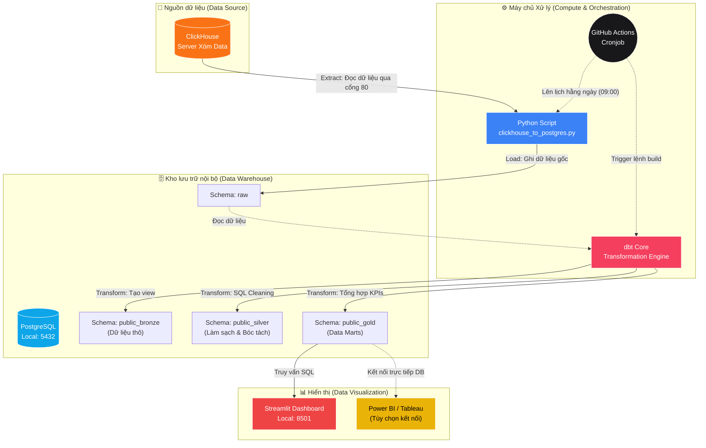
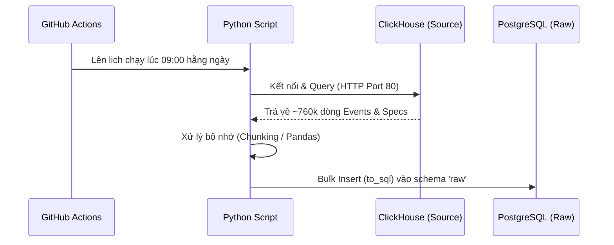
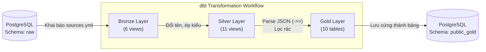
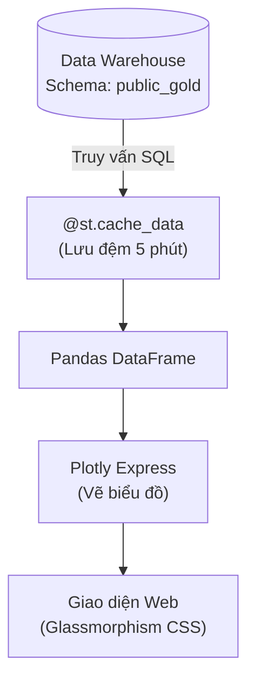

# LaplapTech Analytics Pipeline 🚀

> 💡 **Tóm tắt dự án:** Đây là một hệ thống Data Pipeline hoàn chỉnh (End-to-End) mô phỏng quy trình xử lý dữ liệu của các doanh nghiệp thực tế. Dự án tự động kéo dữ liệu từ nguồn, làm sạch, chuyển đổi và xây dựng Dashboard trực quan phục vụ cho việc ra quyết định.

---

## 🏗️ 1. Sơ đồ Vận hành & Hạ tầng (Architecture & Flow)

Dự án áp dụng kiến trúc **ELT (Extract, Load, Transform)** hiện đại. Dưới đây là sơ đồ chi tiết về dòng chảy dữ liệu (Data Flow) và hạ tầng (Infrastructure):



---

## 🧩 2. Các thành phần, Công nghệ & Giải pháp thay thế

Dưới đây là chi tiết cách hệ thống hoạt động, công nghệ đang dùng và các công nghệ có thể dùng thay thế khi dự án scale lớn hơn:

### 2.1. Tầng Thu thập dữ liệu (Extract & Load)



- **Công nghệ đang dùng:** **Python (Pandas, SQLAlchemy)**. Kéo dữ liệu qua API/HTTP và load trực tiếp vào Database.
- **Cách hoạt động:** Script `clickhouse_to_postgres.py` sẽ "lái xe" sang server ClickHouse, hốt ~760k dòng event mang về đúc vào schema `raw` của PostgreSQL.
- **Có thể thay thế bằng:** **Airbyte**, **Fivetran** (giải pháp SaaS tự động kéo data), hoặc **Kafka** (nếu cần stream data theo thời gian thực thay vì batch).

### 2.2. Kho lưu trữ (Data Warehouse)
- **Công nghệ đang dùng:** **PostgreSQL**. Chạy nội bộ ở Local (Port 5432).
- **Cách hoạt động:** Là trái tim của hệ thống, chứa toàn bộ dữ liệu từ dạng Thô (Raw) đến dạng Tinh chế (Gold).
- **Có thể thay thế bằng:** **Google BigQuery**, **Snowflake**, **Amazon Redshift** (chuẩn Data Warehouse cho doanh nghiệp cực lớn).

### 2.3. Tầng Biến đổi & Làm sạch (Transform)



- **Công nghệ đang dùng:** **dbt (Data Build Tool)**.
- **Cách hoạt động:** Viết mã SQL để biến đổi dữ liệu. Được chia làm 3 lớp chuẩn:
  - **Bronze (6 models):** Ánh xạ (mapping) trực tiếp từ bảng Raw.
  - **Silver (11 models):** Làm sạch, parse chuỗi JSON, lọc dữ liệu rác, xử lý kiểu thời gian.
  - **Gold (10 models):** Aggregation (tổng hợp) thành các bảng Data Mart có sẵn (ví dụ: đếm view, đếm session, rank hiệu năng).
- **Có thể thay thế bằng:** **Apache Spark** (nếu data hàng tỷ dòng), **Google Dataform**.

### 2.4. Tầng Hiển thị (Data Visualization)



- **Công nghệ đang dùng:** **Streamlit & Plotly** (Dashboard Web) / Hỗ trợ kết nối **Power BI**.
- **Cách hoạt động:** Kết nối trực tiếp vào schema `public_gold` của PostgreSQL để vẽ biểu đồ tương tác cực mượt mà không cần xử lý tính toán gì thêm ở front-end.
- **Có thể thay thế bằng:** **Tableau**, **Metabase**, **Apache Superset**.

### 2.5. Tự động hóa (Orchestration)
- **Công nghệ đang dùng:** **GitHub Actions**.
- **Cách hoạt động:** Lên lịch chạy (Cronjob) tự động vào 9 giờ sáng mỗi ngày. Nó sẽ tuần tự chạy Python script -> dbt build.
- **Có thể thay thế bằng:** **Apache Airflow**, **Prefect**, **Dagster** (Quản lý luồng công việc phức tạp, nhiều dependencies hơn).

---

## 🚀 3. Khả năng ứng dụng & Định hướng nâng cấp

### 🎯 Khả năng ứng dụng hiện tại
Dựa vào 10 bảng Gold, hệ thống hiện tại đang trả lời 3 câu hỏi kinh doanh cốt lõi:
1. **Brand Analysis:** Brand nào đang dẫn đầu thị phần quan tâm? Khách hàng hay so sánh hãng A với hãng B nào?
2. **Hardware Trends:** Xu hướng tìm kiếm CPU/GPU thay đổi thế nào qua các tháng?
3. **Performance Metrics:** Phân khúc Laptop nào có hiệu năng/giá tiền hoặc thời lượng pin tốt nhất, và điều đó tác động thế nào đến lượt xem?

### 📈 Định hướng nâng cấp (Scalability)
Nếu đưa hệ thống này lên môi trường Production thực tế, có thể áp dụng các bước:
1. **Containerization (Đóng gói):** Bọc Python Ingestion, dbt và Streamlit vào các **Docker Image** và chạy qua `docker-compose`.
2. **Cloud Migration:** Chuyển PostgreSQL lên **AWS RDS** hoặc **Google Cloud SQL** để tăng tính bảo mật và dễ backup. Đẩy Streamlit lên **Cloud Run**.
3. **Data Quality & Alerting:** Cấu hình dbt tests sâu hơn để bắt lỗi dữ liệu hỏng, tích hợp bắn cảnh báo tự động về Slack/Telegram qua Airflow mỗi khi pipeline fail.

---

## 🛠️ 4. Hướng dẫn cài đặt (Quick Start)

### 4.1. Khởi tạo
```bash
# Clone project & tạo thư mục
cd laplaptech_pipeline

# Tạo virtual environment và kích hoạt
python -m venv venv
.\venv\Scripts\activate  # Windows

# Cài đặt thư viện
pip install -r requirements.txt
```

### 4.2. Cấu hình
```bash
# Copy file môi trường và điền thông tin (Postgres user/pass)
cp .env.example .env
```

### 4.3. Chạy Pipeline
```bash
# Bước 1: Kéo dữ liệu ClickHouse → PostgreSQL
python ingestion/clickhouse_to_postgres.py

# Bước 2: Chạy dbt (Clean & Transform)
cd dbt
dbt build --profiles-dir .

# Bước 3: Mở Dashboard xem kết quả
cd ..
streamlit run streamlit_app/app.py
```

---

## 📁 5. Cấu trúc thư mục (Project Structure)

```
laplaptech_pipeline/
├── .github/workflows/     # GitHub Actions CI/CD
├── dbt/
│   ├── models/
│   │   ├── bronze/        # Raw layer (6 models)
│   │   ├── silver/        # Cleaned layer (11 models)
│   │   └── gold/          # Analytics marts (10 models)
│   ├── dbt_project.yml
│   └── profiles.yml
├── ingestion/
│   └── clickhouse_to_postgres.py
├── streamlit_app/
│   └── app.py             # Dashboard
├── .env.example
├── requirements.txt
└── README.md
```

## 📝 Dataset Attribution

Dataset contributed by **Nguyễn Ngọc Duy Luân (Duy Luân Dễ Thương)** to the
[Xóm Data community](https://www.facebook.com/groups/xomdata). Used for educational analytics and portfolio development.
