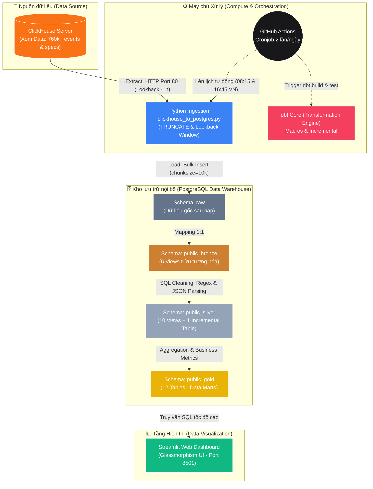
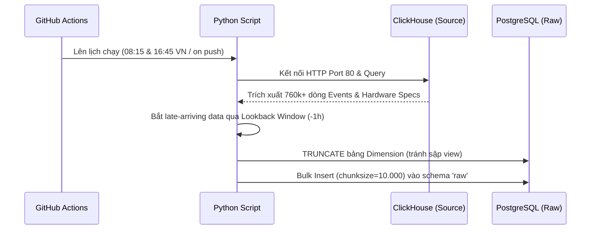
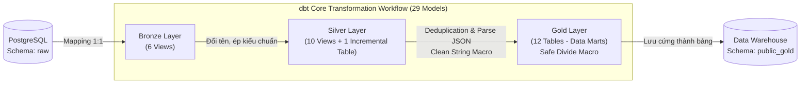

# LaplapTech Analytics Pipeline 🚀

<p align="center">
  <a href="https://github.com/PhucTruong11/laplaptech_pipeline/actions/workflows/sync-pipeline.yml">
    
  </a>
  
  
  
  
  
  
  <a href="LICENSE">
    
  </a>
</p>

> 💡 **Tóm tắt dự án:** Đây là một hệ thống Data Pipeline hoàn chỉnh (End-to-End ELT) mô phỏng quy trình xử lý dữ liệu của các doanh nghiệp thực tế. Dự án tự động trích xuất dữ liệu từ nguồn ClickHouse, nạp vào PostgreSQL Data Warehouse, làm sạch và chuyển đổi qua kiến trúc Medallion (Bronze - Silver - Gold) với dbt, áp dụng các kỹ thuật nâng cao (**Incremental Models**, **Deduplication**, **Lookback Window**, **dbt Macros**, **Data Quality Tests**) và xây dựng Dashboard Streamlit trực quan phục vụ ra quyết định kinh doanh.

---

## 🏗️ 1. Sơ đồ Vận hành & Hạ tầng (Architecture & Flow)

Dự án áp dụng kiến trúc **ELT (Extract, Load, Transform)** hiện đại theo chuẩn Medallion Architecture:


```mermaid
flowchart TD
    %% Định nghĩa các hệ thống
    subgraph Source ["📡 Nguồn dữ liệu (Data Source)"]
        CH[("ClickHouse Server<br>(Xóm Data: 760k+ events & specs)")]
    end

    subgraph Compute ["⚙️ Máy chủ Xử lý (Compute & Orchestration)"]
        PY["Python Ingestion<br>clickhouse_to_postgres.py<br>(TRUNCATE & Lookback Window)"]
        DBT["dbt Core (Transformation Engine)<br>Macros & Incremental"]
        GHA(("GitHub Actions<br>Cronjob 2 lần/ngày"))
    end

    subgraph Storage ["🗄️ Kho lưu trữ nội bộ (PostgreSQL Data Warehouse)"]
        RAW["Schema: raw<br>(Dữ liệu gốc sau nạp)"]
        BRONZE["Schema: public_bronze<br>(6 Views trừu tượng hóa)"]
        SILVER["Schema: public_silver<br>(10 Views + 1 Incremental Table)"]
        GOLD["Schema: public_gold<br>(12 Tables - Data Marts)"]
    end

    subgraph Presentation ["📊 Tầng Hiển thị (Data Visualization)"]
        ST["Streamlit Web Dashboard<br>(Glassmorphism UI - Port 8501)"]
    end

    %% Mũi tên luồng dữ liệu
    CH -- "Extract: HTTP Port 80 (Lookback -1h)" --> PY
    PY -- "Load: Bulk Insert (chunksize=10k)" --> RAW
    RAW -. "Mapping 1:1" .-> BRONZE
    BRONZE -- "SQL Cleaning, Regex & JSON Parsing" --> SILVER
    SILVER -- "Aggregation & Business Metrics" --> GOLD
    GOLD -- "Truy vấn SQL tốc độ cao" --> ST
    GHA -. "Lên lịch tự động (08:15 & 16:45 VN)" .-> PY
    GHA -. "Trigger dbt build & test" .-> DBT

    %% Đổ màu cho sơ đồ đẹp hơn
    style CH fill:#f97316,stroke:#fff,color:#fff
    style PY fill:#3b82f6,stroke:#fff,color:#fff
    style RAW fill:#64748b,stroke:#fff,color:#fff
    style BRONZE fill:#cd7f32,stroke:#fff,color:#fff
    style SILVER fill:#94a3b8,stroke:#fff,color:#fff
    style GOLD fill:#eab308,stroke:#fff,color:#fff
    style DBT fill:#f43f5e,stroke:#fff,color:#fff
    style ST fill:#10b981,stroke:#fff,color:#fff
    style GHA fill:#18181b,stroke:#fff,color:#fff
```

---

## 🧩 2. Các thành phần, Công nghệ & Điểm Nâng Cấp Kỹ Thuật

### 2.1. Tầng Thu thập dữ liệu (Extract & Load)


```mermaid
sequenceDiagram
    participant GH as GitHub Actions
    participant PY as Python Script
    participant CH as ClickHouse (Source)
    participant PG as PostgreSQL (Raw)

    GH->>PY: Lên lịch chạy (08:15 & 16:45 VN / on push)
    PY->>CH: Kết nối HTTP Port 80 & Query
    CH-->>PY: Trích xuất 760k+ dòng Events & Hardware Specs
    PY->>PY: Bắt late-arriving data qua Lookback Window (-1h)
    PY->>PG: TRUNCATE bảng Dimension (tránh sập view)
    PY->>PG: Bulk Insert (chunksize=10.000) vào schema 'raw'
```

- **Công nghệ đang dùng:** **Python (Pandas, SQLAlchemy, clickhouse-connect)**.
- **Điểm nâng cấp quan trọng:**
  - **Idempotency với TRUNCATE:** Thay vì dùng `DROP TABLE` hoặc `if_exists='replace'` (gây xóa sạch các VIEW ở tầng Bronze phía sau), hệ thống dùng `TRUNCATE TABLE raw.<table_name>` kết hợp `if_exists='append'`. Nhờ đó cấu trúc bảng và view luôn được bảo toàn nguyên vẹn.
  - **Lookback Window (-1h):** Bảng sự kiện `user_event_tracking` lấy mốc thời gian lớn nhất trừ lùi 1 giờ để tóm gọn các bản ghi gửi trễ (late-arriving data) do nghẽn mạng hay retry.
  - **Chunking Bulk Insert:** Chia nhỏ từng lô 10.000 dòng (`chunksize=10000`, `method='multi'`) giúp tiết kiệm RAM và tăng tốc độ ghi dữ liệu.

### 2.2. Kho lưu trữ (Data Warehouse)
- **Công nghệ đang dùng:** **PostgreSQL (Supabase trên Cloud hoặc PostgreSQL Local)**.
- **Cách tổ chức:** Phân chia thành các schema độc lập theo Medallion Architecture: `raw`, `public_bronze`, `public_silver`, `public_gold`.

### 2.3. Tầng Biến đổi dữ liệu (Transform với dbt Core)


```mermaid
flowchart LR
    RAW[(PostgreSQL<br>Schema: raw)] -->|Mapping 1:1| BRONZE

    subgraph dbt ["dbt Core Transformation Workflow (29 Models)"]
        direction TB
        BRONZE["Bronze Layer<br>(6 Views)"] -->|"Đổi tên, ép kiểu chuẩn"| SILVER
        SILVER["Silver Layer<br>(10 Views + 1 Incremental Table)"] -->|"Deduplication & Parse JSON<br>Clean String Macro"| GOLD
        GOLD["Gold Layer<br>(12 Tables - Data Marts)<br>Safe Divide Macro"]
    end

    GOLD -->|"Lưu cứng thành bảng"| ST[(Data Warehouse<br>Schema: public_gold)]
```

- **Bronze Layer (6 models - Views):** Ánh xạ trực tiếp từ các bảng Raw, đóng vai trò lớp trừu tượng hóa (Contract layer).
- **Silver Layer (11 models - 10 Views + 1 Incremental Table):**
  - **Incremental Table (`silver_user_event_tracking`):** Chuyển từ View sang bảng Incremental vật lý với `unique_key='id'`, chỉ nạp các dòng mới dựa vào watermark `server_timestamp`. Rút ngắn thời gian parse JSON 760k+ dòng từ vài phút xuống còn **~13 giây**.
  - **Deduplication:** Khử trùng lặp bản ghi phát sinh từ Lookback window bằng hàm `ROW_NUMBER() OVER (PARTITION BY id ORDER BY server_timestamp DESC)`.
  - **Macro `clean_string`:** Chuẩn hóa chuỗi bằng Regex `\s+` loại bỏ khoảng trắng thừa cho tên laptop, CPU, thương hiệu.
- **Gold Layer (12 models - Tables):**
  - Tạo 12 bảng Data Marts chuyên biệt phục vụ phân tích.
  - **Macro `safe_divide`:** Chống lỗi chia cho 0 (`ZeroDivisionError`) khi tính toán tỷ lệ chuyển đổi phễu và ma trận hiệu năng.
- **Data Governance & Quality:**
  - **26 dbt tests** tự động kiểm tra tính duy nhất (`unique`), không rỗng (`not_null`), toàn vẹn khóa ngoại (`relationships`), và giá trị hợp lệ (`accepted_values`).
  - **1 source freshness check** cảnh báo khi dữ liệu nguồn trễ quá 24h.
  - **1 dbt exposure** liên kết Streamlit Dashboard với toàn bộ 12 bảng Gold trên sơ đồ Lineage Graph.

### 2.4. Tầng Hiển thị (Data Visualization)
- **Công nghệ đang dùng:** **Streamlit & Plotly Express** (Port 8501).
- **Tối ưu:** Sử dụng `@st.cache_data(ttl=300)` lưu đệm 5 phút, truy vấn thẳng vào 12 bảng Gold của PostgreSQL, kết hợp giao diện Dark Mode / Glassmorphism CSS hiện đại.

### 2.5. Tự động hóa (Orchestration)
- **Công nghệ đang dùng:** **GitHub Actions** (`.github/workflows/sync-pipeline.yml`).
- **Lịch trình:** Tự động kích hoạt vào lúc **08:15 và 16:45 (Giờ Việt Nam)** hằng ngày, và kích hoạt khi có commit mới trên nhánh `main` hoặc `develop`.

---

## 🚀 3. Giá Trị Kinh Doanh Từ 12 Bảng Gold Data Marts

Hệ thống cung cấp góc nhìn đa chiều phục vụ việc ra quyết định của các phòng ban:
1. **Brand & Product Analytics:** Thị phần quan tâm của các hãng (`mart_brand_interest`), tỷ lệ so sánh giữa các thương hiệu (`mart_brand_comparison`), và nhu cầu theo thông số (`mart_spec_popularity`).
2. **Hardware Trends:** Xu hướng quan tâm các dòng vi xử lý CPU (`mart_cpu_trend`) và card đồ họa GPU (`mart_gpu_trend`) qua từng tháng.
3. **The Efficiency Matrix:** Ma trận hiệu năng laptop (`mart_performance_efficiency`), tính toán điểm hiệu năng trên mỗi Wh dung lượng pin, hiệu năng trên mỗi kg cân nặng máy, và mức độ sụt giảm sức mạnh khi rút sạc.
4. **User Journey & Search Insights:** Phân tích phễu chuyển đổi hành vi (`mart_daily_site_kpis`, `mart_behavior_funnel_daily`), từ khóa tìm kiếm (`mart_search_analytics`), và phân bố hệ điều hành người dùng (`mart_user_os`).

---

## 🛠️ 4. Hướng Dẫn Cài Đặt & Danh Mục Lệnh dbt (Command Cheatsheet)

### 4.1. Cài đặt ban đầu (Setup)

```bash
# 1. Di chuyển vào thư mục dự án
cd laplaptech_pipeline

# 2. Khởi tạo môi trường ảo Python & kích hoạt
python -m venv venv
.\venv\Scripts\activate  # Trên Windows PowerShell
# source venv/bin/activate  # Trên Linux/macOS

# 3. Cài đặt các thư viện cần thiết
pip install -r requirements.txt

# 4. Thiết lập file biến môi trường (ClickHouse & PostgreSQL credentials)
cp .env.example .env
# Mở file .env và điền các thông tin kết nối
```

### 4.2. Chạy nhanh toàn bộ Pipeline (End-to-End Execution)

```bash
# Bước 1: Kéo dữ liệu từ ClickHouse nạp vào PostgreSQL raw
python ingestion/clickhouse_to_postgres.py

# Bước 2: Chuyển đổi dữ liệu và chạy tests với dbt
cd dbt
dbt run
dbt test

# Bước 3: Khởi chạy Streamlit Dashboard
cd ..
streamlit run streamlit_app/app.py
```

---

### 💻 4.3. Bảng Tổng Hợp Lệnh dbt (dbt CLI Cheatsheet)

Tất cả các lệnh dưới đây đều thực hiện từ thư mục `dbt/` (với venv đã được kích hoạt):

| Nhóm thao tác | Lệnh thực thi | Mục đích & Giải thích chi tiết |
|---|---|---|
| **Kiểm tra kết nối** | `dbt debug` | Kiểm tra kết nối tới PostgreSQL và xác thực file `profiles.yml`. |
| **Cài đặt thư viện** | `dbt deps` | Tải về các package dbt mở rộng khai báo trong `packages.yml`. |
| **Biên dịch mã** | `dbt parse` | Kiểm tra cú pháp của toàn bộ file SQL, Jinja, Models và Schemas. |
| | `dbt compile` | Dịch mã Jinja thành các câu lệnh SQL thuần trong thư mục `target/compiled/`. |
| **Chạy Pipeline (Run)** | `dbt run` | **Chạy toàn bộ 29 models**. Model incremental sẽ tự động nạp dữ liệu mới. |
| | `dbt run --select bronze` | Chỉ chạy 6 models thuộc tầng Bronze (Views). |
| | `dbt run --select silver` | Chỉ chạy 11 models thuộc tầng Silver. |
| | `dbt run --select gold` | Chỉ chạy 12 models thuộc tầng Gold (Data Marts). |
| | `dbt run --select silver_user_event_tracking` | Chỉ chạy riêng model sự kiện gia tăng. |
| | `dbt run --select +mart_daily_site_kpis` | Chạy model `mart_daily_site_kpis` và toàn bộ các model thượng nguồn (upstream) của nó. |
| **Re-build từ đầu** | `dbt run --full-refresh` | **Xóa sạch bảng incremental và nạp lại toàn bộ dữ liệu từ đầu**. Dùng khi thay đổi logic bóc tách JSON hoặc cấu trúc schema. |
| **Kiểm thử dữ liệu (Test)** | `dbt test` | **Chạy toàn bộ 26 bài test** kiểm tra ràng buộc `unique`, `not_null`, `accepted_values`, `relationships`. |
| | `dbt test --select silver` | Chỉ chạy các bài test ràng buộc trên tầng Silver. |
| | `dbt test --select test_type:relationships` | Chỉ chạy các bài test kiểm tra toàn vẹn khóa ngoại (Foreign Keys). |
| **Kiểm tra độ tươi** | `dbt source freshness` | Kiểm tra xem bảng `raw.user_event_tracking` có được cập nhật trong vòng 24h qua không. |
| **Lệnh All-in-One** | `dbt build` | **Lệnh tổng hợp:** Chạy tuần tự build models, run tests, kiểm tra freshness cho từng model theo đúng thứ tự DAG. |
| **Tài liệu & Lineage** | `dbt docs generate` | Sinh file tài liệu catalog và biểu đồ phụ thuộc (Lineage Graph). |
| | `dbt docs serve --port 8080` | Mở giao diện web tương tác dbt Docs tại cổng 8080 để khám phá Data Lineage. |

---

## 📁 5. Cấu trúc Thư mục Dự Án (Project Structure)

```
laplaptech_pipeline/
├── .github/
│   └── workflows/
│       └── sync-pipeline.yml           # CI/CD tự động hóa (08:15 & 16:45 hằng ngày)
├── dbt/
│   ├── macros/                         # dbt Jinja Macros dùng chung
│   │   ├── clean_string.sql            # Macro chuẩn hóa chuỗi text (Regex)
│   │   └── safe_divide.sql             # Macro chống lỗi chia cho 0
│   ├── models/
│   │   ├── bronze/                     # 6 models: Views mapping từ raw
│   │   ├── silver/                     # 11 models: 10 views + 1 incremental table
│   │   │   └── silver_user_event_tracking.sql
│   │   ├── gold/                       # 12 models: Data Marts phục vụ Dashboard
│   │   ├── exposures.yml               # Khai báo Lineage kết nối Streamlit
│   │   ├── model_tests.yml             # Khai báo 26 bài test Data Quality
│   │   └── sources.yml                 # Khai báo nguồn raw & Source Freshness
│   ├── dbt_project.yml                 # Cấu hình dự án dbt
│   └── profiles.yml                    # Cấu hình kết nối PostgreSQL
├── docs/
│   └── architecture/
│       └── upgrade_plan.md             # Tài liệu kiến trúc & Nhật ký nâng cấp (ADR)
├── ingestion/
│   └── clickhouse_to_postgres.py       # Script trích xuất (TRUNCATE & Lookback Window)
├── streamlit_app/
│   └── app.py                          # Streamlit Analytics Dashboard
├── SYSTEM_DESIGN_GUIDE.md              # Cẩm nang thiết kế hệ thống dữ liệu
├── requirements.txt                    # Thư viện phụ thuộc
├── .env.example                        # Mẫu cấu hình biến môi trường
└── README.md                           # Tài liệu tổng quan dự án
```

---

## 📝 Dataset Attribution

Dataset contributed by **Nguyễn Ngọc Duy Luân (Duy Luân Dễ Thương)** to the
[Xóm Data community](https://www.facebook.com/groups/xomdata). Used for educational analytics and portfolio development.
