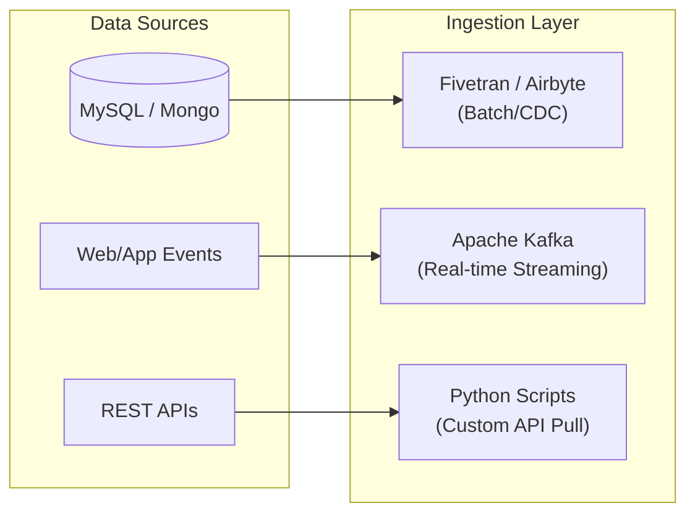
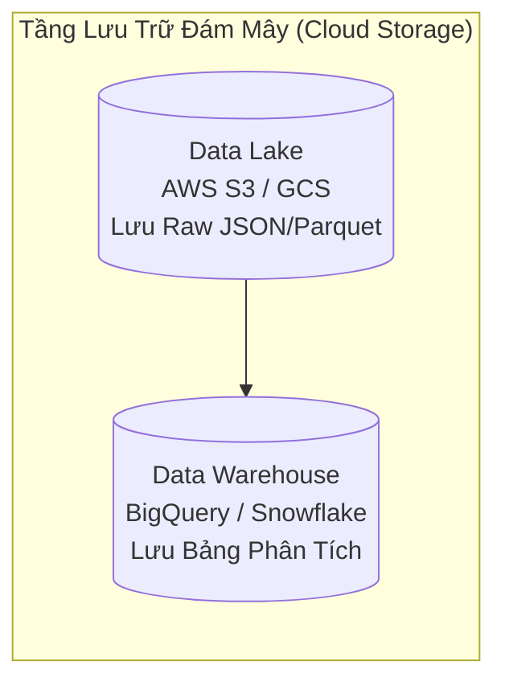
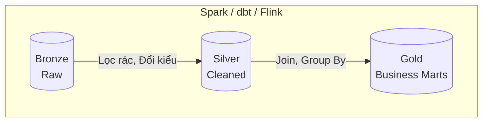
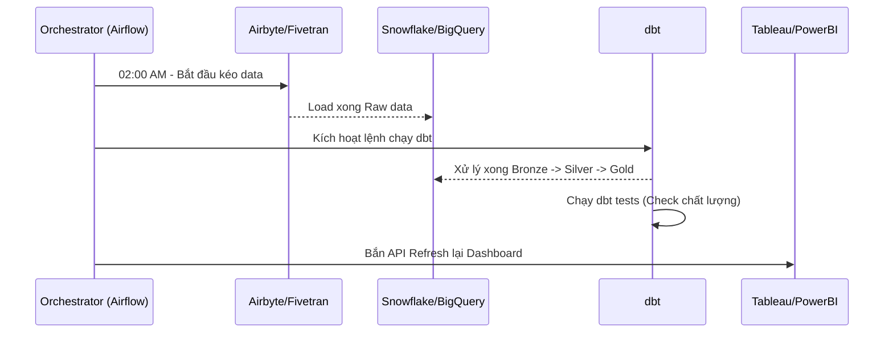

# 🏗️ Hướng Dẫn Thiết Kế Hệ Thống Dữ Liệu (Data System Design Guide)

Tài liệu này tổng hợp quy trình step-by-step để thiết kế một nền tảng dữ liệu (Data Platform) từ quy mô nhỏ (như dự án LaplapTech hiện tại) cho đến quy mô Enterprise (tập đoàn lớn) xử lý hàng Terabyte/Petabyte dữ liệu.

---

## 🧭 Mở đầu: Tư duy cốt lõi khi thiết kế Data System

Trước khi chọn bất kỳ công cụ (tech) nào, một Data/Analytics Engineer luôn phải trả lời 4 chữ V (Volume, Velocity, Variety, Veracity):
1. **Volume:** Lượng dữ liệu lớn cỡ nào? (MBs, GBs hay TBs mỗi ngày?)
2. **Velocity:** Tốc độ cần thiết là bao nhiêu? (Cần cập nhật mỗi ngày một lần - Batch, hay cập nhật tức thời theo thời gian thực - Streaming?)
3. **Variety:** Dữ liệu có cấu trúc (bảng SQL), bán cấu trúc (JSON, XML), hay phi cấu trúc (Video, Hình ảnh)?
4. **Veracity:** Dữ liệu có đáng tin cậy và sạch không?

 Dựa vào 4 yếu tố này, chúng ta sẽ đi qua 5 bước thiết kế cốt lõi dưới đây.

---

## 🛠️ BƯỚC 1: Tầng Thu Thập Dữ Liệu (Data Ingestion / Extract)

Đây là bước lấy dữ liệu từ các nguồn (App, Website, Database, API bên thứ 3) đem về nhà của mình.

### Cách thức xử lý:
- **Batch Processing:** Gom dữ liệu chạy 1 lần/ngày hoặc 1 lần/giờ. Thích hợp cho báo cáo kinh doanh.
- **Stream Processing (Real-time):** Dữ liệu sinh ra là bắt lấy ngay (dưới 1 giây). Thích hợp cho hệ thống gợi ý (Recommendation), chống gian lận (Fraud Detection).
- **CDC (Change Data Capture):** Kỹ thuật "bắt" các thay đổi (INSERT, UPDATE, DELETE) trực tiếp từ database nguồn mà không làm ảnh hưởng đến hiệu năng của app.

### Công nghệ (Tech Stack) & Lựa chọn thay thế:
- **Tự code (Python/Bash):** Dành cho hệ thống nhỏ, tự chủ cao (như ta đang làm).
- **Công cụ kéo thả (SaaS ELT):** **Airbyte**, **Fivetran**, **Stitch**. Ưu điểm: Có sẵn hàng trăm connector kết nối tới Facebook Ads, Google Analytics, MySQL... chỉ bằng vài cú click.
- **Streaming & CDC:** **Apache Kafka**, **Debezium**, **AWS Kinesis**, **Google Pub/Sub**.

---

## 🗄️ BƯỚC 2: Tầng Lưu Trữ (Data Storage)

Dữ liệu đem về phải có chỗ chứa. Chọn sai kiến trúc ở đây sẽ khiến chi phí Cloud tăng phi mã và truy vấn cực chậm.

### Các kiến trúc lưu trữ chính:
1. **Data Warehouse (Kho dữ liệu):** Lưu dữ liệu CÓ cấu trúc (Tables), đã được làm sạch. Tối ưu cực tốt cho truy vấn phân tích (OLAP).
2. **Data Lake (Hồ dữ liệu):** Lưu BẤT KỲ loại dữ liệu nào (File CSV, Parquet, JSON, Hình ảnh) với chi phí cực rẻ (như ổ cứng khổng lồ). Dữ liệu thường rất "đục" (chưa làm sạch).
3. **Data Lakehouse:** Xu hướng mới nhất, kết hợp chi phí rẻ của Data Lake và khả năng truy vấn nhanh của Data Warehouse (dùng định dạng mở như Iceberg, Delta Lake).

### Công nghệ (Tech Stack) & Lựa chọn thay thế:
- **Quy mô nhỏ (GBs):** **PostgreSQL**, **MySQL** (Tuy là OLTP nhưng vẫn gánh tốt data nhỏ).
- **Data Warehouse (Đám mây - TBs):** **Google BigQuery** (Dễ dùng, tính tiền theo query), **Snowflake** (Mạnh mẽ, kiến trúc tách biệt storage & compute), **Amazon Redshift**.
- **Data Lake (Chi phí rẻ):** **AWS S3**, **Google Cloud Storage (GCS)**, **Azure Data Lake Storage (ADLS)**.
- **Lakehouse Formats:** **Apache Iceberg**, **Delta Lake**, **Apache Hudi**.

---

## 🔄 BƯỚC 3: Tầng Biến Đổi & Làm Sạch (Data Transformation)

Dữ liệu nguyên thủy không bao giờ dùng được ngay. Ta phải làm sạch (Clean), gộp (Join), và tổng hợp (Aggregate). Kiến trúc phổ biến nhất hiện nay là **Medallion Architecture**.

### Xử lý ra sao (Medallion Architecture):
1. **Bronze (Raw):** Dữ liệu y xì đúc bản gốc, giữ nguyên lỗi để có thể dò lại (audit) khi cần.
2. **Silver (Cleaned):** Parse JSON, ép chuẩn kiểu dữ liệu (Date, Int), xóa trùng lặp (deduplicate).
3. **Gold (Business Level):** Join các bảng lại, tạo ra các bảng phục vụ trực tiếp phòng ban (VD: `mart_sales_monthly`, `mart_marketing_roi`).

### Công nghệ (Tech Stack) & Lựa chọn thay thế:
- **Nếu xử lý bằng SQL (ELT):** **dbt (Data Build Tool)** - Số 1 hiện nay. Các lựa chọn khác: **Google Dataform**.
- **Nếu xử lý bằng Code cho Big Data (ETL):** **Apache Spark** (dùng PySpark/Scala), **Databricks**. Xử lý phân tán trên hàng ngàn cụm máy chủ.
- **Nếu xử lý Real-time:** **Apache Flink**, **Spark Streaming**.

---

## 📊 BƯỚC 4: Tầng Phục Vụ & Phân Tích (Data Serving & Presentation)

Tầng này dành cho End-users (CEO, Manager, Data Analyst) tiêu thụ dữ liệu.

### Cách thức xử lý:
- **BI & Dashboards:** Trực quan hóa dữ liệu bằng biểu đồ.
- **Reverse ETL:** Đẩy dữ liệu từ Data Warehouse ngược lại các hệ thống vận hành (VD: Đẩy danh sách KH sắp rời bỏ từ BigQuery sang Salesforce / Mailchimp để gửi email giữ chân).
- **Machine Learning:** Đưa bảng Gold cho Data Scientist train mô hình (Dự đoán doanh thu, Churn rate).

### Công nghệ (Tech Stack) & Lựa chọn thay thế:
- **Self-service BI:** **Power BI** (Mạnh về DAX, sinh thái Microsoft), **Tableau** (Đẹp, kéo thả mượt), **Looker** (Quản trị semantic layer mạnh).
- **Open-source BI:** **Apache Superset**, **Metabase** (Dễ setup nhanh cho startup).
- **Data Apps (Code):** **Streamlit**, **Dash**, **Gradio** (Như ta vừa làm, phù hợp cho custom app hoặc app có chứa ML model).
- **Reverse ETL:** **Hightouch**, **Census**.

---

## ⏱️ BƯỚC 5: Tầng Điều Phối & Giám Sát (Orchestration & DataOps)

Khi bạn có 100 bảng cần chạy mỗi ngày, bạn không thể tự bấm bằng tay. Nếu bảng Silver bị lỗi, bảng Gold không được phép chạy. Nếu bảng bị rớt dòng, phải có cảnh báo qua Slack.

### Cách thức xử lý:
- **DAG (Directed Acyclic Graph):** Quy định thứ tự chạy các job. Job A xong mới tới Job B.
- **Data Quality & Observability:** Đặt các bài test (Data tests) kiểm tra xem dữ liệu có bị NULL không, có bị trùng ID không.

### Công nghệ (Tech Stack) & Lựa chọn thay thế:
- **Orchestration:** 
  - **Apache Airflow:** Tượng đài trong ngành, viết pipeline bằng Python.
  - **Prefect / Dagster:** Hai thế hệ mới hơn, truyền data giữa các task xịn hơn và UI đẹp hơn.
  - **GitHub Actions / Cronjob:** Chỉ dùng cho dự án rất nhỏ (như LaplapTech).
- **Data Observability:** **Monte Carlo**, **Great Expectations** (Tự động giám sát chất lượng dữ liệu).

---

## 🏗️ TỔNG HỢP 3 MẪU KIẾN TRÚC PHỔ BIẾN THEO QUY MÔ

### 1. The Modern Data Stack (Phổ biến cho SME & Scale-ups)
Đề cao tốc độ thiết lập, dùng dịch vụ SaaS trên Cloud, chi phí ban đầu linh hoạt.
- **Nguồn -> Airbyte -> Google BigQuery -> dbt -> Metabase / Power BI.**
- **Điều phối bằng:** Apache Airflow hoặc dbt Cloud.

### 2. Big Data & Lakehouse (Phổ biến cho Tập đoàn lớn / Fintech / E-commerce)
Chi phí cao, cần đội ngũ kỹ sư mạnh, xử lý Petabyte dữ liệu, kết hợp AI/ML.
- **Nguồn -> Kafka (Streaming) -> S3/GCS (Data Lake) -> Apache Spark (Transform) -> Delta Lake (Lakehouse) -> Tableau.**
- **Điều phối bằng:** Databricks / Airflow.

### 3. Startup Zero-Budget (Giống dự án LaplapTech)
Xài đồ mã nguồn mở cài trên máy local hoặc 1 server nhỏ, chi phí = 0đ (ngoại trừ tiền điện/máy chủ rẻ).
- **Nguồn -> Python Script -> PostgreSQL -> dbt Core -> Streamlit.**
- **Điều phối bằng:** GitHub Actions / Cron Linux.

---
*Lưu ý: Thiết kế hệ thống không có "viên đạn bạc" (No Silver Bullet). Mọi quyết định chọn tool đều dựa vào: Ngân sách (Budget), Kỹ năng team (Team Skillset), và Nhu cầu thực tế của Business.*
