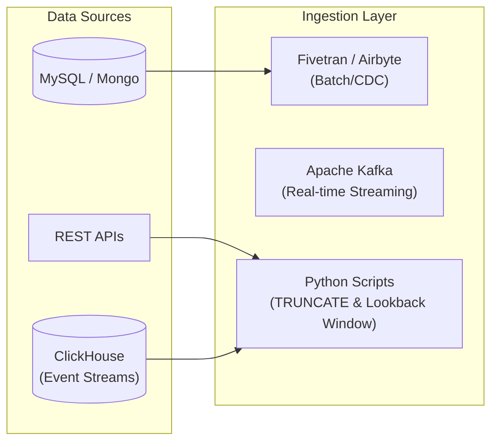
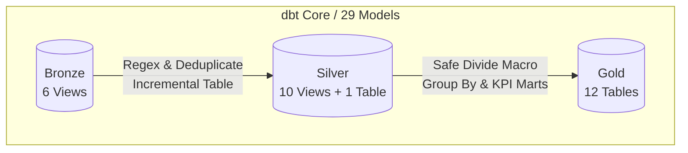
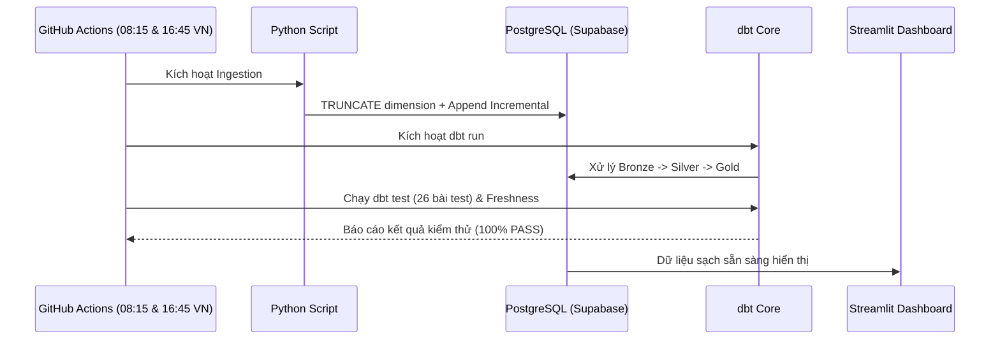

# 🏗️ Hướng Dẫn Thiết Kế Hệ Thống Dữ Liệu (Data System Design Guide)

Tài liệu này tổng hợp quy trình step-by-step để thiết kế một nền tảng dữ liệu (Data Platform) từ quy mô nhỏ (như dự án LaplapTech hiện tại) cho đến quy mô Enterprise (tập đoàn lớn) xử lý hàng Terabyte/Petabyte dữ liệu.

---

## 🧭 Mở đầu: Tư duy cốt lõi khi thiết kế Data System

Trước khi chọn bất kỳ công cụ (tech) nào, một Data/Analytics Engineer luôn phải trả lời 4 chữ V (Volume, Velocity, Variety, Veracity):
1. **Volume:** Lượng dữ liệu lớn cỡ nào? (MBs, GBs hay TBs mỗi ngày?)
2. **Velocity:** Tốc độ cần thiết là bao nhiêu? (Cần cập nhật mỗi ngày một lần - Batch, hay cập nhật tức thời theo thời gian thực - Streaming?)
3. **Variety:** Dữ liệu có cấu trúc (bảng SQL), bán cấu trúc (JSON, XML), hay phi cấu trúc (Video, Hình ảnh)?
4. **Veracity:** Dữ liệu có đáng tin cậy và sạch không?

 Dựa vào 4 yếu tố này, chúng ta sẽ đi qua 5 bước thiết kế cốt lõi dưới đây.

---

## 🛠️ BƯỚC 1: Tầng Thu Thập Dữ Liệu (Data Ingestion / Extract)

Đây là bước lấy dữ liệu từ các nguồn (App, Website, Database, API bên thứ 3) đem về nhà của mình.

### Cách thức xử lý & Kỹ thuật cốt lõi:
- **Batch Processing:** Gom dữ liệu chạy 1 lần/ngày hoặc 1 lần/giờ. Thích hợp cho báo cáo kinh doanh.
- **Incremental & Watermark:** Chỉ lấy dữ liệu mới hơn mốc thời gian lớn nhất (`MAX(timestamp)`) đã nạp trong kho.
- **Lookback Window (Bắt dữ liệu trễ - Late-Arriving Data):** Lùi mốc thời gian lọc lại một khoảng (VD: trừ 1 giờ) để không bị sót các bản ghi gửi trễ do lag mạng hay retry.
- **Idempotency (Tính toàn vẹn khi chạy lại):** Chạy lại script nhiều lần không được làm nhân đôi dữ liệu hay phá vỡ hệ thống:
  - *Kinh nghiệm từ dự án:* Đối với bảng dimension, dùng **`TRUNCATE TABLE raw.<table_name>` kết hợp `append`** thay vì `DROP TABLE ... CASCADE`. Lệnh `DROP` sẽ vô tình làm sập các `VIEW` ở tầng Bronze phụ thuộc phía sau trong PostgreSQL!
- **Stream Processing (Real-time):** Dữ liệu sinh ra là bắt lấy ngay (dưới 1 giây). Thích hợp cho hệ thống gợi ý, chống gian lận.
- **CDC (Change Data Capture):** Bắt các thay đổi (INSERT, UPDATE, DELETE) trực tiếp từ Write-Ahead Log (WAL) của DB nguồn.

### Công nghệ (Tech Stack) & Lựa chọn thay thế:
- **Tự code (Python/Bash):** Dành cho hệ thống nhỏ, tự chủ cao (như `clickhouse_to_postgres.py` dùng SQLAlchemy & Pandas).
- **Công cụ kéo thả (SaaS ELT):** **Airbyte**, **Fivetran**, **Stitch** (có sẵn hàng trăm connector).
- **Streaming & CDC:** **Apache Kafka**, **Debezium**, **AWS Kinesis**, **Google Pub/Sub**.

```mermaid
flowchart LR
    subgraph Data Sources
        API[REST APIs]
        APPDB[(MySQL / Mongo)]
        CH[("ClickHouse<br>(Event Streams)")]
    end

    subgraph Ingestion Layer
        direction TB
        FIVETRAN["Fivetran / Airbyte<br>(Batch/CDC)"]
        KAFKA["Apache Kafka<br>(Real-time Streaming)"]
        PYTHON["Python Scripts<br>(TRUNCATE & Lookback Window)"]
    end

    API --> PYTHON
    CH --> PYTHON
    APPDB --> FIVETRAN
```

---

## 🗄️ BƯỚC 2: Tầng Lưu Trữ (Data Storage)

Dữ liệu đem về phải có chỗ chứa. Chọn sai kiến trúc ở đây sẽ khiến chi phí Cloud tăng phi mã và truy vấn cực chậm.

### Các kiến trúc lưu trữ chính:
1. **Data Warehouse (Kho dữ liệu):** Lưu dữ liệu CÓ cấu trúc (Tables), đã được làm sạch. Tối ưu cực tốt cho truy vấn phân tích (OLAP).
2. **Data Lake (Hồ dữ liệu):** Lưu BẤT KỲ loại dữ liệu nào (File CSV, Parquet, JSON, Hình ảnh) với chi phí cực rẻ (như ổ cứng khổng lồ). Dữ liệu thường rất "đục" (chưa làm sạch).
3. **Data Lakehouse:** Kết hợp chi phí rẻ của Data Lake và khả năng truy vấn nhanh của Data Warehouse (dùng định dạng mở như Iceberg, Delta Lake).

### Cách phân chia Schema trong Data Warehouse (Medallion Layout):
- `raw`: Chứa dữ liệu gốc vừa nạp từ Ingestion (chưa sửa đổi).
- `public_bronze`: Lớp View trừu tượng hóa ánh xạ 1:1 từ `raw`.
- `public_silver`: Lớp dữ liệu đã làm sạch, parse JSON, chuẩn hóa và nạp gia tăng.
- `public_gold`: Lớp Data Marts tổng hợp nghiệp vụ, phục vụ trực tiếp BI.

### Công nghệ (Tech Stack) & Lựa chọn thay thế:
- **Quy mô nhỏ (GBs):** **PostgreSQL (Supabase)**, **MySQL** (Tuy là OLTP nhưng gánh tốt data nhỏ, Supabase cung cấp Postgres serverless rất tiện lợi cho Data Platform mini).
- **Data Warehouse (Đám mây - TBs):** **Google BigQuery**, **Snowflake**, **Amazon Redshift**.
- **Data Lake (Chi phí rẻ):** **AWS S3**, **Google Cloud Storage (GCS)**, **Azure Data Lake Storage (ADLS)**.
- **Lakehouse Formats:** **Apache Iceberg**, **Delta Lake**, **Apache Hudi**.

---

## 🔄 BƯỚC 3: Tầng Biến Đổi & Làm Sạch (Data Transformation)

Dữ liệu nguyên thủy không bao giờ dùng được ngay. Ta phải làm sạch (Clean), gộp (Join), khử trùng (Deduplicate) và tổng hợp (Aggregate). Kiến trúc phổ biến nhất hiện nay là **Medallion Architecture**.

### Xử lý ra sao (Medallion Architecture trong dbt):
1. **Bronze (Raw Views):** Dữ liệu ánh xạ nguyên bản từ bảng Raw, đóng vai trò hợp đồng dữ liệu (Data Contract).
2. **Silver (Cleaned & Incremental):**
   - **Bóc tách JSON:** Dùng toán tử `->>` hoặc `#>>` để bóc các trường sâu trong JSON.
   - **Deduplication:** Khử trùng lặp phát sinh từ Lookback window bằng `ROW_NUMBER() OVER (PARTITION BY id ORDER BY timestamp DESC)`.
   - **Incremental Loading:** Với bảng sự kiện lớn (760k+ dòng), chuyển thành bảng **Incremental Table** với `unique_key` và bộ lọc `is_incremental()` để chỉ xử lý dữ liệu mới, giảm tải 95% thời gian chạy.
   - **Macros:** Tạo hàm Jinja tái sử dụng (VD: `clean_string` dùng Regex chuẩn hóa khoảng trắng).
3. **Gold (Business Level - Data Marts):**
   - Join các bảng lại tạo ra 12 bảng Data Marts chuyên biệt (`mart_daily_site_kpis`, `mart_performance_efficiency`, `mart_brand_interest`...).
   - Dùng macro `safe_divide` để bảo vệ các phép tính tỷ lệ chuyển đổi, hiệu năng pin không bị lỗi `Division by zero`.

### Công nghệ (Tech Stack) & Lựa chọn thay thế:
- **Nếu xử lý bằng SQL (ELT):** **dbt (Data Build Tool)** - Số 1 hiện nay. Các lựa chọn khác: **Google Dataform**.
- **Nếu xử lý bằng Code cho Big Data (ETL):** **Apache Spark** (dùng PySpark/Scala), **Databricks**.
- **Nếu xử lý Real-time:** **Apache Flink**, **Spark Streaming**.

```mermaid
flowchart TD
    subgraph Transformation Engine [dbt Core / 29 Models]
        direction LR
        B[(Bronze<br>6 Views)] -->|Regex & Deduplicate<br>Incremental Table| S[(Silver<br>10 Views + 1 Table)]
        S -->|Safe Divide Macro<br>Group By & KPI Marts| G[(Gold<br>12 Tables)]
    end
```

---

## 📊 BƯỚC 4: Tầng Phục Vụ & Phân Tích (Data Serving & Presentation)

Tầng này dành cho End-users (CEO, Manager, Data Analyst) tiêu thụ dữ liệu.

### Cách thức xử lý:
- **BI & Dashboards:** Trực quan hóa dữ liệu bằng biểu đồ phân tích.
- **Tối ưu tốc độ:** Sử dụng Cache tầng ứng dụng (như `@st.cache_data` với TTL) để giảm thiểu số lượng truy vấn trực tiếp vào Database.
- **Data Lineage:** Khai báo dbt `exposures` để nối dashboard vào đồ thị luồng dữ liệu của toàn bộ kho.

### Công nghệ (Tech Stack) & Lựa chọn thay thế:
- **Data Apps (Code):** **Streamlit**, **Dash**, **Gradio** (Dự án này sử dụng hoàn toàn Streamlit với giao diện Glassmorphism CSS).
- **BI Tools truyền thống:** **Metabase**, **Tableau**, **Power BI**, **Apache Superset**.

---

## ⏱️ BƯỚC 5: Tầng Điều Phối & Giám Sát (Orchestration & DataOps)

Khi có hàng chục bảng cần chạy mỗi ngày, phải có hệ thống điều phối tự động và cơ chế giám sát chất lượng dữ liệu.

### Cách thức xử lý:
- **DAG (Directed Acyclic Graph):** Quy định thứ tự chạy các job. Job Ingestion xong mới chạy dbt Bronze -> Silver -> Gold.
- **Data Quality Tests:** Tự động kiểm tra tính toàn vẹn (26 tests `unique`, `not_null`, `accepted_values`, `relationships`).
- **Source Freshness:** Bắn cảnh báo nếu dữ liệu nguồn không được cập nhật sau 24h hoặc 48h.
- **Tài liệu hóa (Docs):** Sinh Lineage Graph và Catalog qua `dbt docs`.

### Công nghệ (Tech Stack) & Lựa chọn thay thế:
- **Orchestration:** 
  - **GitHub Actions:** Rất tiện lợi cho dự án nhỏ/vừa, lên lịch tự động 2 lần/ngày (08:15 & 16:45 VN) kết hợp kích hoạt khi có commit mới.
  - **Apache Airflow:** Chuẩn Enterprise cho pipeline phức tạp.
  - **Prefect / Dagster:** Thế hệ mới với UI đẹp và quản lý Data Assets tốt hơn.
- **Data Observability:** **Monte Carlo**, **Great Expectations**.

```mermaid
sequenceDiagram
    participant GH as GitHub Actions (08:15 & 16:45 VN)
    participant Ingestion as Python Script
    participant Warehouse as PostgreSQL (Supabase)
    participant Transform as dbt Core
    participant App as Streamlit Dashboard

    GH->>Ingestion: Kích hoạt Ingestion
    Ingestion->>Warehouse: TRUNCATE dimension + Append Incremental
    GH->>Transform: Kích hoạt dbt run
    Transform->>Warehouse: Xử lý Bronze -> Silver -> Gold
    GH->>Transform: Chạy dbt test (26 bài test) & Freshness
    Transform-->>GH: Báo cáo kết quả kiểm thử (100% PASS)
    Warehouse->>App: Dữ liệu sạch sẵn sàng hiển thị
```

---

## 🏗️ TỔNG HỢP 3 MẪU KIẾN TRÚC PHỔ BIẾN THEO QUY MÔ

### 1. The Modern Data Stack (Phổ biến cho SME & Scale-ups)
- **Nguồn -> Airbyte -> Google BigQuery -> dbt -> Metabase / Power BI.**
- **Điều phối bằng:** Apache Airflow hoặc dbt Cloud.

### 2. Big Data & Lakehouse (Phổ biến cho Tập đoàn lớn / Fintech / E-commerce)
- **Nguồn -> Kafka (Streaming) -> S3/GCS (Data Lake) -> Apache Spark (Transform) -> Delta Lake (Lakehouse) -> Tableau.**
- **Điều phối bằng:** Databricks / Airflow.

### 3. Startup Zero-Budget / High-Efficiency (Kiến trúc chuẩn của LaplapTech Pipeline)
Chi phí tối ưu, tự chủ hoàn toàn mã nguồn, hiệu năng cao và đáp ứng trọn vẹn quy trình Data Engineering chuyên nghiệp:
- **Nguồn:** ClickHouse Server (760k+ dòng).
- **Ingestion:** Python (Lookback window -1h, TRUNCATE & chunking bulk insert).
- **Storage:** PostgreSQL (Supabase / Local) với kiến trúc Medallion (Raw, Bronze, Silver, Gold).
- **Transformation:** dbt Core (29 models: 6 Bronze Views, 10 Silver Views, 1 Silver Incremental Table, 12 Gold Mart Tables; Macros `clean_string` & `safe_divide`).
- **Data Quality:** 26 automated tests + 1 source freshness test + 1 exposure lineage.
- **Serving:** Streamlit Web App (Plotly charts, Glassmorphism UI, cached queries).
- **Điều phối:** GitHub Actions CI/CD (Cronjob 2 lần/ngày: 08:15 & 16:45 VN time).

---
*Lưu ý: Thiết kế hệ thống không có "viên đạn bạc" (No Silver Bullet). Mọi quyết định chọn tool đều dựa vào: Ngân sách (Budget), Kỹ năng team (Team Skillset), và Nhu cầu thực tế của Business.*
