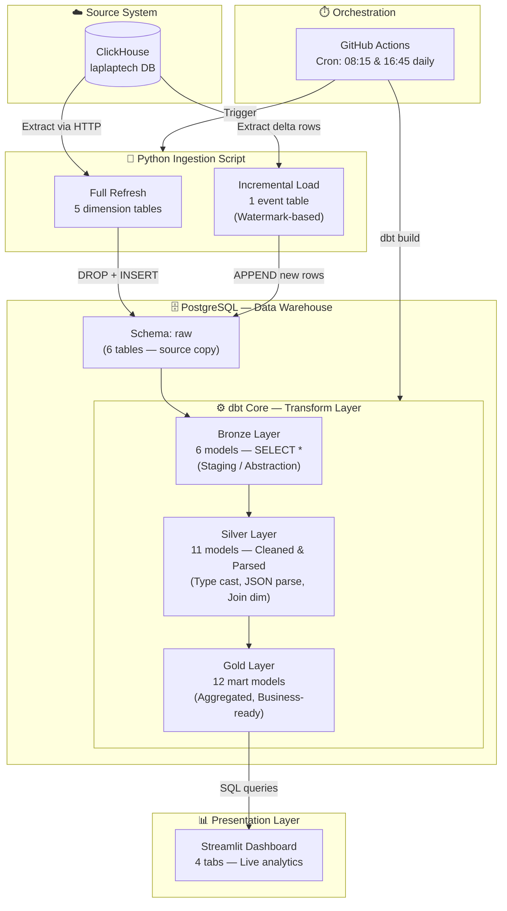
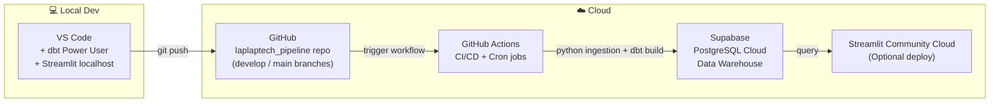
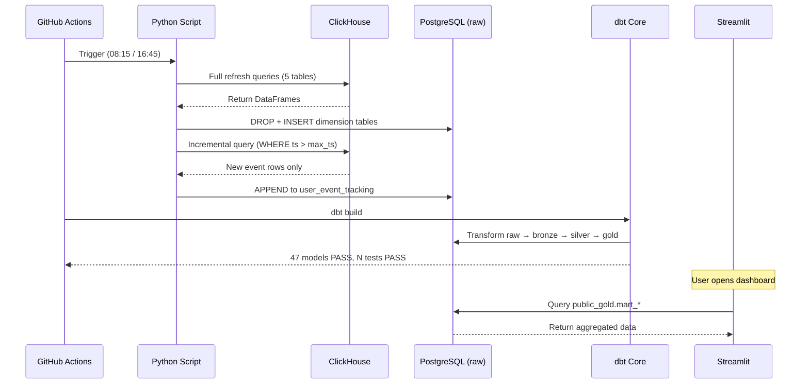

# 01 — System Overview

> **Mục tiêu:** Cung cấp bức tranh toàn cảnh của hệ thống — từ nguồn dữ liệu cho đến lớp trình bày.

---

## Tech Stack

| Layer | Technology | Vai trò |
|---|---|---|
| **Source** | ClickHouse | OLAP database của hệ thống LapLapTech |
| **Ingestion** | Python (`clickhouse-connect`, `pandas`, `SQLAlchemy`) | Extract & Load |
| **Warehouse** | PostgreSQL (Supabase / Local) | Data Warehouse |
| **Transform** | dbt Core 1.12 | ELT transformation, testing, docs |
| **Orchestration** | GitHub Actions (cron) | Scheduling daily pipeline |
| **Visualization** | Streamlit + Plotly + AgGrid | Analytics Dashboard |

---

## End-to-End Data Flow

---

## Deployment Architecture

---

## Data Volume & Scale (hiện tại)

| Table | Type | Rows (approx) | Load Strategy |
|---|---|---|---|
| `brand` | Dimension | ~50 | Full Refresh |
| `cpu_model` | Dimension | ~200 | Full Refresh |
| `gpu_model` | Dimension | ~150 | Full Refresh |
| `laptop_model` | Dimension | ~500 | Full Refresh |
| `laptop_benchmark_result` | Dimension | ~300 | Full Refresh |
| `user_event_tracking` | **Fact** | **~760,000+** | **Incremental** |

---

## Pipeline Execution Timeline

