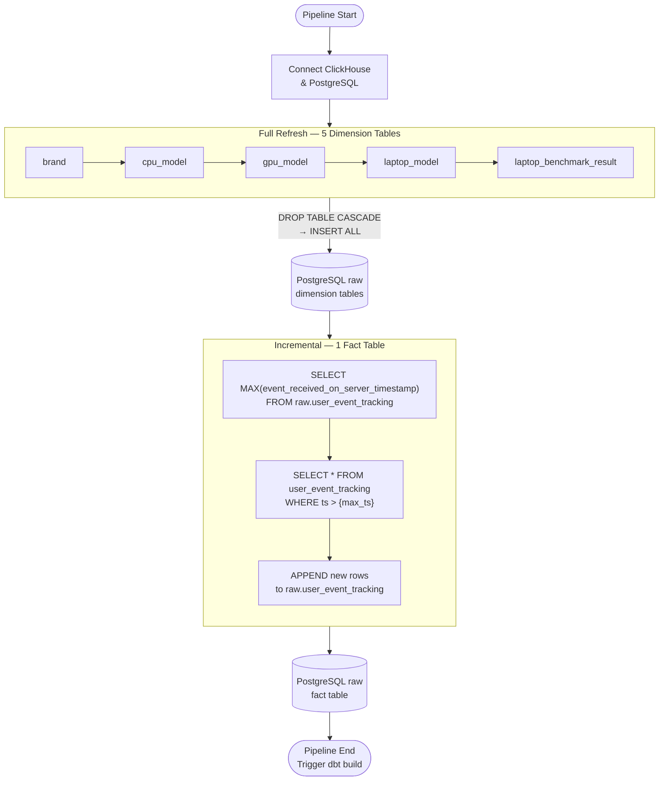

# 02 — Ingestion Layer

> **Mục tiêu:** Tài liệu hóa toàn bộ cơ chế Extract & Load — lý do thiết kế, ưu/nhược điểm, và các rủi ro kỹ thuật.

---

## Tổng quan

File: [`ingestion/clickhouse_to_postgres.py`](../../ingestion/clickhouse_to_postgres.py)

Ingestion layer thực hiện pattern **EL** (Extract → Load) — chỉ chịu trách nhiệm đưa raw data về PostgreSQL, **không transform**. Toàn bộ logic transform được dbt xử lý riêng biệt.

---

## Strategy: Full Refresh vs Incremental



---

## Full Refresh — Chi tiết

### Khi nào dùng Full Refresh?
- Bảng nhỏ (< 10,000 rows) — cost extract thấp
- Data có thể **thay đổi bất kỳ row nào** (UPDATE/DELETE ở source) — không thể dùng watermark
- Cần đảm bảo **100% consistency** với source

### Cơ chế thực tế
```python
# Bước 1: Xóa bảng cũ (CASCADE để xóa cả dependent views)
DROP TABLE IF EXISTS raw.brand CASCADE

# Bước 2: Insert toàn bộ data mới
df.to_sql('brand', schema='raw', if_exists='append', ...)
```

> **Tại sao dùng `DROP ... CASCADE` thay vì `TRUNCATE`?**
> Vì Bronze layer tạo các **Views** (`SELECT *`) đọc từ Raw. `TRUNCATE` không ảnh hưởng view, nhưng `DROP TABLE` sẽ xóa cả dependent views — và dbt sẽ tái tạo chúng khi `dbt build`. Đây là cách đảm bảo không có stale views.

### Tính Idempotent ✅
Full Refresh là **idempotent hoàn toàn**: chạy 1 lần hay 10 lần, kết quả trong DB luôn giống nhau.

---

## Incremental — Chi tiết

### Cơ chế Watermark (High-Water Mark)
```python
# 1. Đọc watermark từ DB
max_ts = SELECT MAX(event_received_on_server_timestamp)
         FROM raw.user_event_tracking

# 2. Chỉ lấy rows mới hơn watermark
SELECT * FROM user_event_tracking
WHERE event_received_on_server_timestamp > '{max_ts}'

# 3. Append vào DB
df.to_sql(..., if_exists='append')
```

### Tại sao Incremental cho `user_event_tracking`?
- **760,000+ rows** — Full Refresh mất 2-3 phút và tốn băng thông
- Data chỉ **INSERT** (events không bao giờ bị UPDATE hoặc DELETE)
- Watermark column `event_received_on_server_timestamp` là monotonically increasing

---

## ⚠️ Known Issue: Late-Arriving Data

### Vấn đề
```
Timeline thực tế:
  09:55 ─── Event xảy ra trên client
  10:00 ─── Pipeline chạy, lấy max_ts = 09:59:00
  10:05 ─── Event mới arrive vào ClickHouse (do network delay)

Kết quả: Event 09:55 KHÔNG BAO GIỜ được load ❌
         (nằm trong khoảng 09:55-09:59 nhưng arrive sau max_ts)
```

### Giải pháp đề xuất: Lookback Window
```python
# Thay vì:
WHERE event_received_on_server_timestamp > '{max_ts}'

# Dùng (lookback 2 giờ):
WHERE event_received_on_server_timestamp > '{max_ts}' - INTERVAL 2 HOUR
```

Kết hợp **xóa và re-insert** trong lookback window để tránh duplicate:
```sql
-- Bước 1: Xóa rows trong lookback window (có thể đã load trước đó)
DELETE FROM raw.user_event_tracking
WHERE event_received_on_server_timestamp > ('{max_ts}'::timestamp - INTERVAL '2 hours');

-- Bước 2: Insert lại toàn bộ rows trong lookback window từ source
-- (sẽ bao gồm cả late-arriving events)
INSERT INTO raw.user_event_tracking ...
```

**Trade-off:** Số rows xử lý tăng nhẹ (khoảng 2 giờ data thay vì chỉ delta), nhưng **data accuracy tăng đáng kể**.

---

## Idempotency Analysis

| Scenario | Kết quả | Ghi chú |
|---|---|---|
| Run Full Refresh 2 lần liên tiếp | ✅ Giống nhau | DROP + INSERT đảm bảo |
| Run Incremental 2 lần cùng khoảng thời gian | ⚠️ Duplicate | Cần dedup |
| Pipeline fail giữa chừng (sau Full Refresh, trước Incremental) | ✅ An toàn | Dimension OK, Fact chưa update |
| ClickHouse down trong lúc query | ✅ Rollback | Exception handler sẽ `sys.exit(1)` |

---

## GitHub Actions Workflow

```yaml
# .github/workflows/ — chạy 2 lần/ngày
schedule:
  - cron: '15 1 * * *'   # 08:15 ICT
  - cron: '45 9 * * *'   # 16:45 ICT

steps:
  1. Checkout code
  2. Setup Python + install requirements.txt
  3. python ingestion/clickhouse_to_postgres.py
  4. cd dbt && dbt build
```
