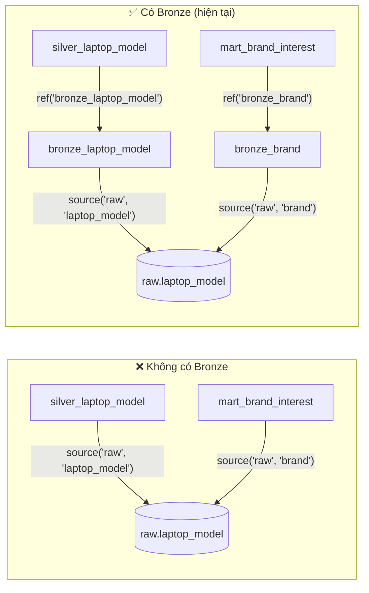
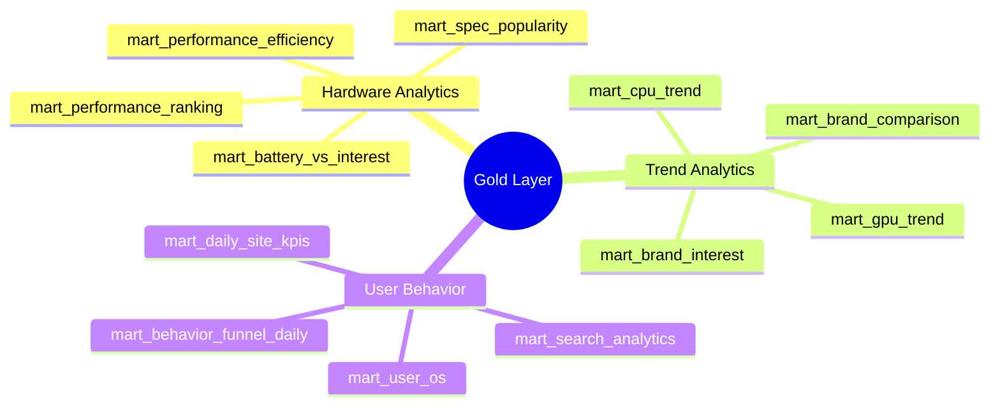

# 03 — Medallion Architecture

> **Mục tiêu:** Phân tích thiết kế từng tầng trong kiến trúc Medallion (Raw → Bronze → Silver → Gold) — lý do tồn tại, trách nhiệm, và quyết định kỹ thuật.

---

## Tổng quan Medallion Architecture

```mermaid
flowchart LR
    subgraph RAW["🪨 Raw\nschema: raw"]
        R1["brand"]
        R2["cpu_model"]
        R3["gpu_model"]
        R4["laptop_model"]
        R5["laptop_benchmark_result"]
        R6["user_event_tracking\n(760k+ rows)"]
    end

    subgraph BRONZE["🥉 Bronze\nschema: public_bronze\nmaterialized: view"]
        B1["bronze_brand"]
        B2["bronze_cpu_model"]
        B3["bronze_gpu_model"]
        B4["bronze_laptop_model"]
        B5["bronze_laptop_benchmark_result"]
        B6["bronze_user_event_tracking"]
    end

    subgraph SILVER["🥈 Silver\nschema: public_silver\nmaterialized: view"]
        S1["silver_brand"]
        S2["silver_cpu_model"]
        S3["silver_gpu_model"]
        S4["silver_laptop_model\n(enriched + joined)"]
        S5["silver_laptop_benchmark_result\n(parsed + typed)"]
        S6["silver_user_event_tracking\n(JSON parsed)"]
        S7["silver_session_activity\n(aggregated per session)"]
        S8["silver_session_funnel"]
        S9["silver_device_traffic_event"]
        S10["silver_comparison_session_device"]
        S11["silver_comparison_sort_event"]
    end

    subgraph GOLD["🥇 Gold\nschema: public_gold\nmaterialized: table"]
        G1["mart_brand_interest"]
        G2["mart_battery_vs_interest"]
        G3["mart_performance_ranking"]
        G4["mart_performance_efficiency"]
        G5["mart_cpu_trend"]
        G6["mart_gpu_trend"]
        G7["mart_brand_comparison"]
        G8["mart_spec_popularity"]
        G9["mart_daily_site_kpis"]
        G10["mart_behavior_funnel_daily"]
        G11["mart_user_os"]
        G12["mart_search_analytics"]
    end

    RAW -->|"source()"| BRONZE
    BRONZE -->|"ref()"| SILVER
    SILVER -->|"ref()"| GOLD
```



---

## Raw Layer

### Trách nhiệm
Nơi chứa **bản sao trung thực** của data từ source (ClickHouse). Không có bất kỳ transform nào.

### Lý do giữ Raw (Architectural Thinking)

| Lý do | Giải thích |
|---|---|
| **Reproducibility** | Nếu transform logic sai, chạy lại `dbt build` từ Raw mà không cần re-ingest |
| **Debugging** | Trace anomaly từ Gold ngược về Raw để tìm nguồn gốc lỗi |
| **Source Preservation** | ClickHouse là hệ thống của team khác, data có thể thay đổi/xóa bất kỳ lúc nào |
| **Separation of Concerns** | Ingestion script chỉ biết "lấy data về", không biết gì về transform |

### Không transform ở Raw vì
- Raw là "bằng chứng" — nó phải giống y hệt source tại thời điểm extract
- Nếu cần debug, bạn cần so sánh Raw với ClickHouse; nếu Raw đã bị transform thì không còn ý nghĩa

---

## Bronze Layer

### Trách nhiệm
**Staging & Abstraction** — cắt đứt sự phụ thuộc trực tiếp giữa Silver/Gold và schema `raw`.

### Thiết kế hiện tại
```sql
-- bronze_brand.sql (điển hình)
SELECT * FROM {{ source('raw', 'brand') }}
```

Pure pass-through. Không filter, không cast, không rename.

### Tại sao cần Bronze nếu chỉ `SELECT *`?



**Lợi ích:** Nếu đổi nguồn data (ClickHouse → Airbyte → CSV), chỉ cần sửa `sources.yml` + Bronze, không đụng đến Silver/Gold.

### Khi nào Bronze cần làm thêm?

| Kịch bản | Bronze nên thêm |
|---|---|
| Thêm nguồn data thứ 2 cùng loại | `UNION ALL` các nguồn |
| Source schema thay đổi liên tục | `COALESCE(new_col, old_col)` backward compat |
| Data volume > 10M rows | `WHERE` filter sớm để giảm tải Silver |
| Nhiều team dùng chung | Metadata columns: `_source`, `_loaded_at` |

---

## Silver Layer

### Trách nhiệm
**Cleaning, Typing, Parsing, Joining** — biến raw data thành dữ liệu sạch, có kiểu dữ liệu đúng, có thể tin cậy.

### Các transformation đang thực hiện

#### 1. Type Casting
```sql
-- silver_laptop_model.sql
lm.id::int                    AS laptop_model_id,
lm.screen_size::numeric       AS screen_size,
lm.is_visible::boolean        AS is_visible,
```

#### 2. Data Cleaning
```sql
TRIM(lm.name)                 AS laptop_name,
WHERE event_name IS NOT NULL
  AND session_id IS NOT NULL
```

#### 3. JSON Parsing
```sql
-- silver_user_event_tracking.sql
event_data::json ->> 'device_id'    AS device_id,
event_data::json ->> 'page_name'    AS page_name,
event_data::json ->> 'keyword'      AS search_keyword,
device::json     ->> 'os'           AS user_os,
device::json     ->> 'browser'      AS user_browser,
```

#### 4. Dimensional Joining (Denormalization)
```sql
-- silver_laptop_model.sql — enriched with brand, CPU, GPU names
FROM bronze_laptop_model lm
LEFT JOIN silver_brand     b ON lm.brand_id::int    = b.brand_id
LEFT JOIN silver_cpu_model c ON lm.cpu_model_id::int = c.cpu_id
LEFT JOIN silver_gpu_model g ON lm.gpu_model_id::int = g.gpu_id
```

#### 5. Session Aggregation
```sql
-- silver_session_activity.sql
SELECT
    session_id,
    MIN(server_timestamp) AS session_start,
    MAX(server_timestamp) AS session_end,
    COUNT(*)              AS event_count,
    MAX(CASE WHEN event_name = 'pageview' THEN 1 ELSE 0 END)::boolean AS has_pageview,
    ...
FROM silver_user_event_tracking
GROUP BY session_id
```

### Câu hỏi thiết kế: Có nên thêm Normalization?

**Không cần** — đây là data warehouse, không phải OLTP. Mục tiêu là **query nhanh**, không phải **tránh duplicate update**.

Denormalized Silver (có `brand_name`, `cpu_name` sẵn trong `laptop_model`) cho phép Gold mart query với JOIN tối giản → performance tốt hơn.

---

## Gold Layer

### Trách nhiệm
**Aggregation & Business Logic** — tạo ra các bảng "business-ready" mà Streamlit dashboard có thể query trực tiếp.

### Materialization Strategy

```
Bronze → Silver: materialized: VIEW
                 (No physical storage — always fresh, lazy evaluation)

Silver → Gold:   materialized: TABLE
                 (Physical storage — pre-computed, fast query for dashboard)
```

**Tại sao Gold là TABLE thay vì VIEW?**

Streamlit query Gold mỗi lần user load dashboard. Nếu Gold là VIEW, mỗi lần query sẽ phải JOIN + aggregate hàng trăm nghìn rows từ Silver → chậm. TABLE pre-compute sẵn, Streamlit chỉ cần `SELECT * FROM mart_*` → nhanh.

### 12 Gold Mart Models


