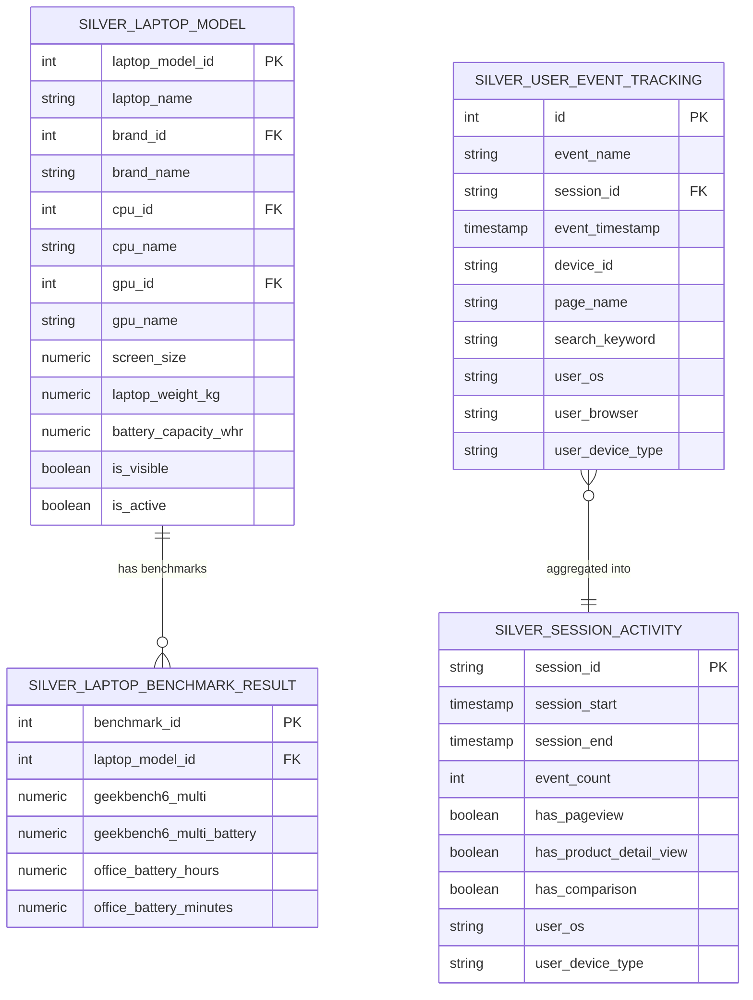

# 04 — Data Models

> **Mục tiêu:** Tài liệu hóa toàn bộ Data Models — Star Schema design, lineage graph, và mô tả từng model.

---

## Star Schema (Gold Layer)

Ở tầng Gold, dự án theo kiến trúc **Star Schema** với:
- **Fact tables:** Các bảng chứa metrics/events (thường lớn, có timestamps)
- **Dimension tables:** Các bảng chứa attributes (nhỏ, descriptive)



---

## Full Lineage Graph

```mermaid
flowchart TD
    %% Raw Sources
    R_brand[("raw.brand")]
    R_cpu[("raw.cpu_model")]
    R_gpu[("raw.gpu_model")]
    R_lm[("raw.laptop_model")]
    R_bench[("raw.laptop_benchmark_result")]
    R_evt[("raw.user_event_tracking")]

    %% Bronze
    B_brand["bronze_brand"]
    B_cpu["bronze_cpu_model"]
    B_gpu["bronze_gpu_model"]
    B_lm["bronze_laptop_model"]
    B_bench["bronze_laptop_benchmark_result"]
    B_evt["bronze_user_event_tracking"]

    %% Silver
    S_brand["silver_brand"]
    S_cpu["silver_cpu_model"]
    S_gpu["silver_gpu_model"]
    S_lm["silver_laptop_model"]
    S_bench["silver_laptop_benchmark_result"]
    S_evt["silver_user_event_tracking"]
    S_sess["silver_session_activity"]
    S_funnel["silver_session_funnel"]
    S_traffic["silver_device_traffic_event"]
    S_comp["silver_comparison_session_device"]
    S_sort["silver_comparison_sort_event"]

    %% Gold
    G_brand_int["mart_brand_interest"]
    G_batt_int["mart_battery_vs_interest"]
    G_perf["mart_performance_ranking"]
    G_eff["mart_performance_efficiency"]
    G_cpu["mart_cpu_trend"]
    G_gpu["mart_gpu_trend"]
    G_brand_comp["mart_brand_comparison"]
    G_spec["mart_spec_popularity"]
    G_kpi["mart_daily_site_kpis"]
    G_funnel["mart_behavior_funnel_daily"]
    G_os["mart_user_os"]
    G_search["mart_search_analytics"]

    %% Edges: Raw → Bronze
    R_brand --> B_brand
    R_cpu --> B_cpu
    R_gpu --> B_gpu
    R_lm --> B_lm
    R_bench --> B_bench
    R_evt --> B_evt

    %% Edges: Bronze → Silver
    B_brand --> S_brand
    B_cpu --> S_cpu
    B_gpu --> S_gpu
    B_lm --> S_lm
    B_bench --> S_bench
    B_evt --> S_evt
    S_brand --> S_lm
    S_cpu --> S_lm
    S_gpu --> S_lm
    S_evt --> S_sess
    S_evt --> S_funnel
    S_evt --> S_traffic
    S_evt --> S_comp
    S_evt --> S_sort

    %% Edges: Silver → Gold
    S_lm --> G_brand_int
    S_evt --> G_brand_int
    S_lm --> G_batt_int
    S_bench --> G_batt_int
    S_evt --> G_batt_int
    S_lm --> G_perf
    S_bench --> G_perf
    S_lm --> G_eff
    S_bench --> G_eff
    S_cpu --> G_cpu
    S_evt --> G_cpu
    S_gpu --> G_gpu
    S_evt --> G_gpu
    S_lm --> G_brand_comp
    S_bench --> G_brand_comp
    S_evt --> G_brand_comp
    S_lm --> G_spec
    S_bench --> G_spec
    S_sess --> G_kpi
    S_sess --> G_funnel
    S_sess --> G_os
    S_evt --> G_search
```



---

## Model Descriptions

### Bronze Models (6)

| Model | Source | Materialized | Description |
|---|---|---|---|
| `bronze_brand` | `raw.brand` | view | Brand dimension pass-through |
| `bronze_cpu_model` | `raw.cpu_model` | view | CPU model pass-through |
| `bronze_gpu_model` | `raw.gpu_model` | view | GPU model pass-through |
| `bronze_laptop_model` | `raw.laptop_model` | view | Laptop master data pass-through |
| `bronze_laptop_benchmark_result` | `raw.laptop_benchmark_result` | view | Benchmark results pass-through |
| `bronze_user_event_tracking` | `raw.user_event_tracking` | view | 760k+ clickstream events pass-through |

### Silver Models (11)

| Model | Key Transform | Materialized |
|---|---|---|
| `silver_brand` | Type cast `id::int`, trim name | view |
| `silver_cpu_model` | Type cast, trim | view |
| `silver_gpu_model` | Type cast, trim | view |
| `silver_laptop_model` | **JOIN** brand + CPU + GPU, type cast, trim | view |
| `silver_laptop_benchmark_result` | Parse benchmark types, extract Geekbench 6 battery | view |
| `silver_user_event_tracking` | **JSON parse** `event_data` & `device`, timestamp convert | view |
| `silver_session_activity` | **Aggregate** events per session, session-level flags | view |
| `silver_session_funnel` | Funnel stage detection per session | view |
| `silver_device_traffic_event` | Device + OS traffic per event | view |
| `silver_comparison_session_device` | Device IDs involved in comparison sessions | view |
| `silver_comparison_sort_event` | Sort behavior in comparison feature | view |

### Gold Models (12)

| Model | Business Question | Key Metrics |
|---|---|---|
| `mart_brand_interest` | Brand nào được xem nhiều nhất? | `total_views`, `unique_sessions` |
| `mart_battery_vs_interest` | Laptop nào hút người dùng & pin tốt? | `total_views`, `office_battery_hours` |
| `mart_performance_ranking` | Laptop nào mạnh nhất? | `geekbench6_multi`, `performance_rank` |
| `mart_performance_efficiency` | Laptop nào hiệu quả nhất / kg & Wh? | `performance_per_kg`, `performance_drop_pct` |
| `mart_cpu_trend` | CPU nào đang được quan tâm theo thời gian? | `total_views` by `month` |
| `mart_gpu_trend` | GPU nào đang hot? | `total_views` by `month` |
| `mart_brand_comparison` | Người dùng so sánh brand nào nhiều nhất? | `comparison_sessions`, `avg_geekbench` |
| `mart_spec_popularity` | Cấu hình nào phổ biến nhất? | `model_count`, `avg_battery`, `avg_geekbench` |
| `mart_daily_site_kpis` | Site KPIs hàng ngày? | `total_sessions`, `sessions_with_detail_view` |
| `mart_behavior_funnel_daily` | Funnel conversion hàng ngày? | `view_rate`, `comparison_rate` |
| `mart_user_os` | User dùng OS/device gì? | `sessions` by `user_os`, `device_type` |
| `mart_search_analytics` | Product gaps từ search behavior? | `search_volume`, `unique_sessions` |

---

## Data Quality Tests (dbt)

```yaml
# model_tests.yml
silver_brand:
  - brand_id: unique, not_null

silver_cpu_model:
  - cpu_id: unique, not_null

silver_gpu_model:
  - gpu_id: unique, not_null

silver_laptop_model:
  - laptop_model_id: unique, not_null
  - brand_id: not_null, relationships(silver_brand.brand_id)

silver_laptop_benchmark_result:
  - benchmark_id: unique, not_null
  - laptop_model_id: not_null

mart_brand_interest:
  - brand_id: unique, not_null

mart_performance_ranking:
  - laptop_model_id: unique, not_null
```

**Tổng: 18 data tests** chạy mỗi lần `dbt build`.
