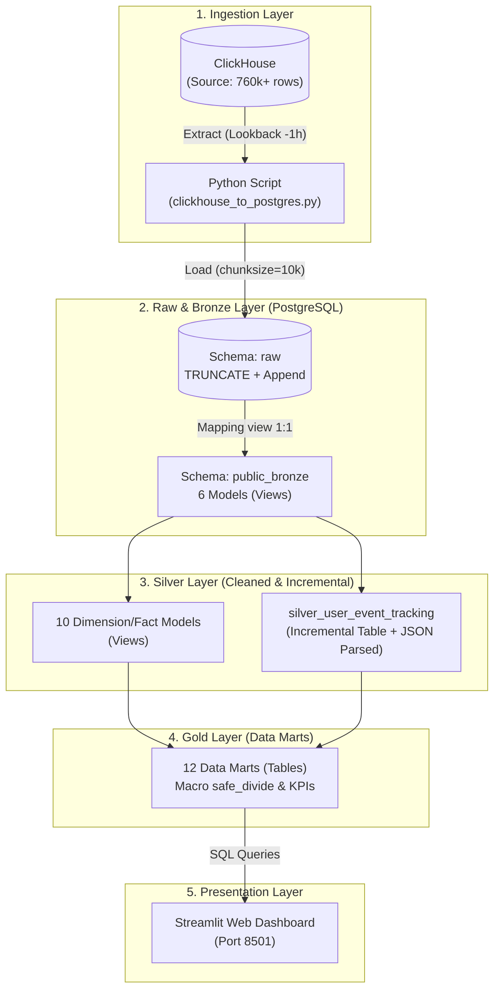

# 🚀 LapLapTech Pipeline — Upgrade & Learning Plan

> **Mục tiêu tài liệu:** Phân tích từng concept kiến trúc Data Engineering, đánh giá mức độ phù hợp với project, và ghi lại toàn bộ nhật ký nâng cấp hệ thống (System Upgrade Log). Tài liệu này đóng vai trò như một cẩm nang kiến trúc (Architecture Decision Record - ADR) để sau này xem lại sẽ hiểu rõ hệ thống đã được nâng cấp ra sao và lý do đằng sau mỗi quyết định kỹ thuật.
>
> 🏁 **Trạng thái dự án:** **HOÀN THÀNH TẠI SPRINT 2** — Hệ thống đã đạt chuẩn Production-Ready với đầy đủ tính toàn vẹn (Idempotency), nạp gia tăng (Incremental), kiểm thử dữ liệu (Data Quality Tests), và tài liệu hóa Lineage Graph.

---

## 📋 1. Tổng quan đánh giá nhanh các Concept

| Concept | Đã áp dụng? | Độ ưu tiên | Trạng thái triển khai thực tế |
|---|---|---|---|
| **Late-arriving data & Lookback Window** | ✅ Đã áp dụng | HIGH | Bổ sung cửa sổ trượt 1 giờ (`Lookback window = -1h`) trong Ingestion Script |
| **Deduplication** | ✅ Đã áp dụng | HIGH | Sử dụng hàm cửa sổ `ROW_NUMBER()` ở tầng Silver (`silver_user_event_tracking`) |
| **Idempotency** | ✅ Đã áp dụng | HIGH | Thay `DROP CASCADE` bằng `TRUNCATE` + `Append` ở Raw; dùng `unique_key` ở Incremental |
| **Incremental Models** | ✅ Đã áp dụng | HIGH | Chuyển đổi `silver_user_event_tracking` sang bảng Incremental (tiết kiệm 95% thời gian) |
| **dbt Macros** | ✅ Đã áp dụng | MEDIUM | Tạo `clean_string` (chuẩn hóa Regex) và `safe_divide` (chống lỗi chia cho 0) |
| **Data Quality Tests** | ✅ Đã áp dụng | HIGH | 26 tests tự động (`unique`, `not_null`, `accepted_values`, `relationships`) |
| **Source Freshness** | ✅ Đã áp dụng | HIGH | Giám sát độ tươi dữ liệu bảng `raw.user_event_tracking` (Cảnh báo 24h / Lỗi 48h) |
| **dbt Exposures** | ✅ Đã áp dụng | MEDIUM | Khai báo Lineage kết nối Streamlit Dashboard với toàn bộ 12 bảng Gold Marts |
| **dbt Docs** | ✅ Đã áp dụng | MEDIUM | Sinh catalog và tài liệu tự động qua `dbt docs generate` |
| **Medallion Architecture (Raw-Bronze-Silver-Gold)** | ✅ Đã tối ưu | HIGH | 29 models: 6 Bronze (Views) → 11 Silver (10 Views + 1 Incremental Table) → 12 Gold (Tables) |
| **CDC (Change Data Capture)** | ⚠️ Học để biết | LOW | Không áp dụng (Batch 2 lần/ngày, CDC là overkill và tốn tài nguyên hạ tầng) |
| **dbt Snapshots (SCD Type 2)** | ⏳ Tương lai | LOW | Tạm hoãn (Dataset hiện tại chưa có trường biến động giá theo thời gian) |
| **dbt Seeds (Manual Price)** | ⏳ Tương lai | LOW | Tùy chọn mở rộng khi có dữ liệu giá laptop thị trường |
| **BI Tool (Metabase/Lightdash)** | ⚠️ Học để biết | LOW | Streamlit đang đáp ứng xuất sắc vai trò Data App với CSS Glassmorphism |

---

## 🔍 2. Phân tích chi tiết các Concept & Quyết định Kỹ thuật (ADR)

### 2.1. Late-Arriving Data & Lookback Window
- **Vấn đề:** Sự kiện xảy ra ở máy khách lúc 23:50 nhưng do rớt mạng hoặc retry, tới 00:15 hôm sau mới ghi vào ClickHouse. Nếu chỉ lấy `timestamp > max_timestamp` thì bản ghi đó sẽ bị bỏ sót vĩnh viễn.
- **Giải pháp thực tế:** 
  - Trong file `ingestion/clickhouse_to_postgres.py`, tại hàm `extract_incremental()`, hệ thống tự động trừ lùi 1 giờ (`max_ts - 3600s` hoặc `timedelta(hours=1)`).
  - Thu thập toàn bộ dữ liệu trong khoảng trễ mà không sợ mất mát.

### 2.2. Idempotency & Chiến lược TRUNCATE vs DROP
- **Vấn đề gặp phải:** Trước đây khi nạp bảng Dimension (brand, cpu, gpu, laptop_model), script Ingestion dùng `DROP TABLE` hoặc `if_exists='replace'`. Trong PostgreSQL, khi một bảng nguồn bị DROP CASCADE, **toàn bộ các VIEW phụ thuộc ở tầng Bronze phía sau sẽ bị PostgreSQL xóa sạch**, dẫn tới việc `dbt run` báo lỗi `relation "public_bronze.xxx" does not exist`.
- **Giải pháp thực tế:** 
  - Đổi cơ chế sang: `TRUNCATE TABLE raw.<table_name>` rồi nạp bằng `if_exists='append'`.
  - Lệnh `TRUNCATE` chỉ xóa sạch dữ liệu bên trong nhưng **giữ nguyên vẹn định nghĩa bảng và các VIEW phụ thuộc**, giúp pipeline đạt tính Idempotent 100% (chạy bao nhiêu lần cũng không hỏng view).

### 2.3. Deduplication (Khử trùng lặp)
- **Vấn đề:** Việc dùng Lookback Window 1 giờ khiến một số bản ghi ở khoảng giao thoa bị kéo về 2 lần.
- **Giải pháp thực tế:**
  - Tại tầng Silver (`dbt/models/silver/silver_user_event_tracking.sql`), áp dụng hàm cửa sổ:
    ```sql
    ROW_NUMBER() OVER (
        PARTITION BY id
        ORDER BY event_received_on_server_timestamp DESC
    ) AS row_num
    ```
  - Lọc `WHERE row_num = 1` để đảm bảo mỗi sự kiện chỉ tồn tại duy nhất một phiên bản mới nhất.

### 2.4. Incremental Models cho dữ liệu lớn
- **Vấn đề:** Bảng sự kiện `user_event_tracking` chứa hơn **760.000 dòng** với hai cột JSON phức tạp (`event_data` và `device`). Nếu để dạng VIEW hoặc nạp Full-Refresh mỗi lần, PostgreSQL phải parse lại toàn bộ JSON từ đầu, tốn hàng phút và nghẽn CPU.
- **Giải pháp thực tế:**
  - Chuyển `silver_user_event_tracking` thành bảng **Incremental Table** với cấu hình:
    ```sql
    {{ config(
        materialized='incremental',
        unique_key='id',
        on_schema_change='sync_all_columns'
    ) }}
    ```
  - Ở các lần chạy tiếp theo, dbt chỉ lọc những dòng có `server_timestamp > (SELECT MAX(server_timestamp) FROM {{ this }})`. Thời gian chạy giảm từ vài phút xuống còn **~13 giây**!

### 2.5. dbt Macros (Tái sử dụng logic & An toàn tính toán)
- Đã tạo 2 Macros dùng chung trong thư mục `dbt/macros/`:
  1. `clean_string.sql`: Sử dụng biểu thức chính quy `TRIM(REGEXP_REPLACE({{ column_name }}, '\s+', ' ', 'g'))` để loại bỏ toàn bộ khoảng trắng thừa, dấu tab rác trong dữ liệu text. Đã áp dụng cho `silver_brand`, `silver_cpu_model`, `silver_laptop_model`.
  2. `safe_divide.sql`: Xử lý phép chia an toàn với cấu trúc `CASE WHEN denominator IS NOT NULL AND denominator != 0 THEN ROUND(...) ELSE NULL END`, bảo vệ pipeline tuyệt đối trước lỗi `Division by zero` khi tính toán tỷ lệ chuyển đổi hoặc hiệu năng trên pin ở `mart_daily_site_kpis` và `mart_performance_efficiency`.

### 2.6. Data Quality & Data Governance
- **Generic Tests (26 tests - 100% PASS):**
  - Ràng buộc khóa chính: `unique`, `not_null` cho toàn bộ các bảng Silver và Gold quan trọng.
  - Ràng buộc khóa ngoại: `relationships` đối chiếu `laptop_model.brand_id` sang `silver_brand.brand_id`, `cpu_id` sang `silver_cpu_model`, `gpu_id` sang `silver_gpu_model`, và benchmark results sang `silver_laptop_model`.
  - Ràng buộc miền giá trị: `accepted_values` kiểm tra cờ `is_visible`, `is_active` chỉ nhận `[true, false]`.
- **Source Freshness (1 test - PASS):** Giám sát bảng `raw.user_event_tracking` dựa trên cột `to_timestamp(event_received_on_server_timestamp)`, cảnh báo nếu dữ liệu trễ quá 24 giờ và báo lỗi nếu trễ quá 48 giờ.
- **Lineage Exposures (1 exposure):** Khai báo dashboard Streamlit trong `exposures.yml`, liên kết tường minh với 12 bảng Gold Marts trong Lineage Graph của dbt Docs.

---

## 🏛️ 3. Kiến trúc Đa tầng (Medallion Architecture) Hiện tại



### Thống kê quy mô tầng dữ liệu:
- **Tầng Bronze (6 Views):** `bronze_brand`, `bronze_cpu_model`, `bronze_gpu_model`, `bronze_laptop_model`, `bronze_laptop_benchmark_result`, `bronze_user_event_tracking`.
- **Tầng Silver (11 Models):** 
  - 10 Views: `silver_brand`, `silver_cpu_model`, `silver_gpu_model`, `silver_laptop_model`, `silver_laptop_benchmark_result`, `silver_comparison_session_device`, `silver_comparison_sort_event`, `silver_device_traffic_event`, `silver_session_activity`, `silver_session_funnel`.
  - 1 Incremental Table: `silver_user_event_tracking` (bóc tách JSON `->>`, khử trùng lặp `ROW_NUMBER()`).
- **Tầng Gold (12 Tables):** `mart_daily_site_kpis`, `mart_brand_interest`, `mart_brand_comparison`, `mart_performance_ranking`, `mart_performance_efficiency`, `mart_battery_vs_interest`, `mart_behavior_funnel_daily`, `mart_cpu_trend`, `mart_gpu_trend`, `mart_search_analytics`, `mart_spec_popularity`, `mart_user_os`.
- **Tổng cộng:** **29 models**, **26 data tests**, **1 source freshness check**, **1 exposure**.

---

## 📅 4. Nhật Ký Triển Khai Chi Tiết (Upgrade Log)

### 🟢 Sprint 1 — Fast Wins & Data Governance ✅ (HOÀN THÀNH)
- [x] **1.1 Data Quality Tests**: Xây dựng bộ kiểm thử tự động trong `dbt/models/model_tests.yml` với 26 tests (`unique`, `not_null`, `accepted_values`, `relationships`). Kết quả: **26/26 PASS**.
- [x] **1.2 Lineage Exposures**: Tạo file `dbt/models/exposures.yml` liên kết Streamlit Dashboard với toàn bộ 12 bảng Gold Marts.
- [x] **1.3 Source Freshness**: Cấu hình kiểm tra độ tươi dữ liệu trong `dbt/models/sources.yml` cho bảng `raw.user_event_tracking`. Kết quả: **1/1 PASS**.
- [x] **1.4 dbt Docs & Lineage Graph**: Sinh tài liệu tự động và kiểm tra luồng phụ thuộc DAG qua `dbt docs generate` & `dbt docs serve`.

### 🟢 Sprint 2 — Core Data Engineering & Idempotency ✅ (HOÀN THÀNH)
- [x] **2.1 Sửa lỗi phá vỡ View khi Ingestion**: Thay thế triệt để lệnh `DROP TABLE ... CASCADE` bằng cơ chế `TRUNCATE TABLE raw.<table_name>` kết hợp `to_sql(if_exists='append')`. Nhờ đó, các Bronze Views của PostgreSQL không bao giờ bị xóa nhầm.
- [x] **2.2 Xử lý Late-Arriving Data**: Tích hợp cửa sổ trượt Lookback Window 1 giờ (`timestamp >= max_ts - 3600s`) trong `ingestion/clickhouse_to_postgres.py`.
- [x] **2.3 Deduplication ở Tầng Silver**: Dùng hàm `ROW_NUMBER() OVER (PARTITION BY id ORDER BY event_received_on_server_timestamp DESC)` để lọc duy nhất bản ghi mới nhất, loại bỏ hoàn toàn nguy cơ trùng lặp do Lookback window.
- [x] **2.4 Tối ưu hiệu năng bằng Incremental Model**: Nâng cấp `silver_user_event_tracking` từ View thành Incremental Table với `unique_key='id'` và `is_incremental()` watermark filter. Rút ngắn thời gian xử lý 760k+ dòng xuống chỉ còn vài giây.
- [x] **2.5 Chuẩn hóa với dbt Macros**: Tạo và triển khai thành công 2 macros `clean_string` và `safe_divide`, áp dụng nhất quán trên 5 models Silver và Gold.
- [x] **2.6 Đồng bộ tài liệu và chú thích code (Code Comments)**: Thêm docstring và chú thích tiếng Việt chi tiết cho toàn bộ các hàm trong `ingestion/clickhouse_to_postgres.py` cũng như các file mô hình dbt.

### 🟡 Sprint 3 — Định hướng Production-Grade nâng cao (Nuance Analysis) ⏳
> *Ghi chú: Hệ thống hiện tại đã đáp ứng tốt các yêu cầu logic. Tuy nhiên, nếu muốn nâng cấp dự án lên chuẩn Production-Grade cấp độ Enterprise thực thụ, có 2 "nuance" (khía cạnh nhỏ nhưng quan trọng) về kiến trúc cần được giải quyết trong tương lai.*

#### 3.1. Physical vs. Logical Idempotency ở Tầng RAW
- **Hiện trạng:** Tầng Ingestion đang dùng cơ chế *Lookback* và *Append* thẳng vào RAW. Điều này dẫn tới việc RAW có thể chứa các physical rows (dòng vật lý) bị trùng lặp. Việc khử trùng lặp (Dedup) đang được phó thác cho hàm `ROW_NUMBER()` ở tầng Silver.
- **Đánh giá:** Cách làm này **không sai** nếu chủ đích của ta là giữ RAW giống lịch sử nguồn (ingestion history) nhất có thể. Cần phân biệt rõ: *RAW physical idempotency* (không trùng lặp vật lý ở RAW) khác với *Silver logical idempotency* (dữ liệu sạch sẽ ở tầng xử lý logic).
- **Giải pháp tương lai:** Để hệ thống hoàn hảo hơn, thay vì chỉ Append, Ingestion từ ClickHouse vào PostgreSQL có thể áp dụng mô hình **MERGE / UPSERT (Insert on Conflict)**. Khi đó RAW sẽ tự động được Physical Dedup ngay từ đầu vào.

#### 3.2. Late Data Handling vs. Incremental Lookback
- **Hiện trạng:** Tầng Ingestion có Lookback 1h, nhưng Incremental Model của Silver lại lọc cứng theo `timestamp > MAX(server_timestamp)`.
- **Đánh giá:** *Lookback ở Ingestion không tự động có nghĩa là Downstream cũng reprocess (xử lý lại) phần lookback đó.* Giả sử một event có timestamp cũ bị trễ, nó vẫn được Ingestion hút về và *Append* vào RAW nhờ Lookback 1h. Tuy nhiên, vì timestamp của nó nhỏ hơn `MAX(server_timestamp)` hiện có ở Silver, Incremental filter sẽ bỏ qua nó! Hàm `ROW_NUMBER()` chỉ có tác dụng deduplicate những dòng *đã lọt vào CTE*, chứ không tự làm cho Incremental model quay lại đọc dữ liệu cũ.
- **Giải pháp tương lai:** Khái niệm *Late data handling ≠ Lookback ở một layer*. Cần thiết kế lại logic Incremental của dbt sao cho có thể xử lý Lookback đồng bộ (ví dụ: filter ở Silver cũng phải lùi một khoảng thời gian trước MAX, sau đó áp dụng UPSERT/MERGE để cập nhật/xóa trùng lặp ở đích).

#### 3.3. Các tính năng Backlog khác (Tùy chọn)
- [ ] `dbt seeds` (`seeds/laptop_manual_price.csv`): Tạo bảng giá tham chiếu thủ công để phân tích tương quan cấu hình/giá tiền (Price-to-Performance Ratio) khi có nguồn thu thập giá bán lẻ.
- [ ] `dbt snapshots` (SCD Type 2): Lưu vết biến động lịch sử thông số hoặc giá bán laptop theo thời gian.
- [ ] `dbt-expectations`: Thư viện kiểm thử nâng cao theo phân phối thống kê (chuẩn hóa outlier, độ lệch chuẩn).
- [ ] Kết nối thêm BI tool như Metabase vào PostgreSQL Neon để đối sánh với Streamlit.

---

## 💻 5. Hướng Dẫn Chạy Toàn Bộ Hệ Thống (Pipeline Cheatsheet)

Dưới đây là các lệnh chuẩn để vận hành hệ thống từ đầu nguồn tới cuối nguồn:

```powershell
# ==============================================================================
# BƯỚC 1: KÍCH HOẠT MÔI TRƯỜNG ẢO
# ==============================================================================
cd d:\Dev\Project\laplaptech_pipeline
.\venv\Scripts\activate

# ==============================================================================
# BƯỚC 2: CHẠY INGESTION (CLICKHOUSE → POSTGRESQL RAW)
# ==============================================================================
python ingestion\clickhouse_to_postgres.py

# ==============================================================================
# BƯỚC 3: TRANSFORM DỮ LIỆU & KIỂM THỬ VỚI DBT
# ==============================================================================
cd dbt

# 3.1. Chạy toàn bộ 29 models (Chế độ Incremental tự động)
dbt run

# 3.2. Chạy 26 bài test kiểm tra chất lượng dữ liệu
dbt test

# 3.3. Kiểm tra độ tươi của dữ liệu nguồn
dbt source freshness

# 3.4. (Tùy chọn) Re-build toàn bộ dữ liệu từ đầu (khi muốn reset incremental)
# dbt run --full-refresh

# 3.5. (Tùy chọn) Mở giao diện xem sơ đồ Lineage Graph và tài liệu dbt Docs
# dbt docs generate
# dbt docs serve --port 8080

# ==============================================================================
# BƯỚC 4: KHỞI CHẠY DASHBOARD STREAMLIT
# ==============================================================================
cd ..
streamlit run streamlit_app\app.py
```

---

> 📝 **Tài liệu bàn giao kiến trúc (ADR)** — Hoàn thiện và đóng gói thành công sau Sprint 2 (26/09/2026).
